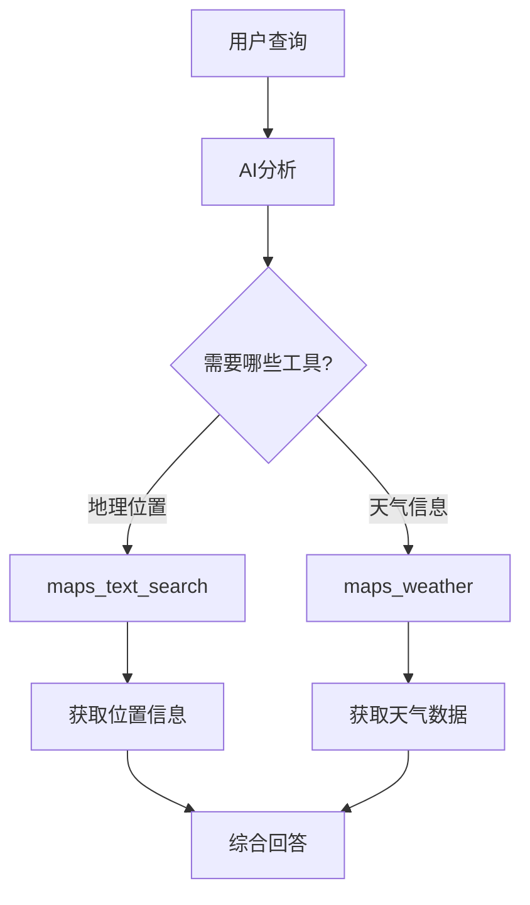
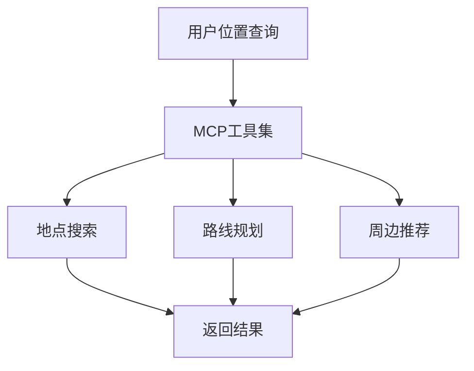
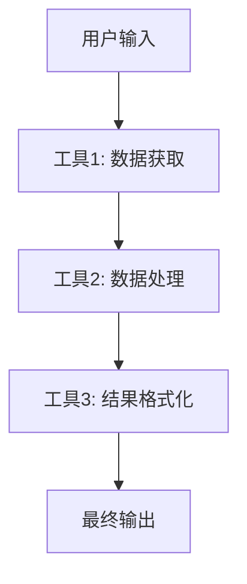

# MCP 工具集

快速了解 MCP 工具接入 FastGPT

FastGPT v4.9.6 版本开始，新增了 **MCP 工具集** 这种新的应用类型，允许传入一个 MCP 的 SSE URL 来批量创建可被模型轻松调用的 MCP 工具。

## 什么是 MCP

MCP（Model Context Protocol）是一个标准化的协议，用于在 AI 模型和外部工具之间建立连接。通过 MCP，AI 模型可以动态地调用各种外部服务和工具，大大扩展了其功能范围。

### MCP 的优势

- **标准化接口**：统一的协议规范，便于集成各种工具
- **动态调用**：AI 可以根据需要智能选择和调用工具
- **批量创建**：一次性导入多个相关工具
- **实时数据**：获取最新的外部数据和服务

## 创建 MCP 工具集

### 第一步：获取 MCP 地址

首先需要获取到一个有效的 MCP 地址，例如：

```
https://mcp.amap.com/sse?key=xxx
```

以对接高德地图的 MCP Server 为例，该服务提供了地图搜索、天气查询等多种功能。

### 第二步：创建工具集

1. 在 FastGPT 中选择**新建 MCP 工具集**
2. 填入 MCP 地址到对应位置
3. 点击**解析**按钮
4. 系统会自动解析出对应的一系列工具
5. 点击**创建**完成 MCP 工具集的创建

<!-- MCP工具集创建界面图 -->

### 第三步：工具配置

创建完成后，可以对每个工具进行个性化配置：

- **工具名称**：自定义工具的显示名称
- **工具描述**：详细说明工具的功能和用途
- **参数配置**：设置工具所需的参数
- **权限设置**：控制工具的访问权限

## 测试 MCP 工具

### 单独测试

进入到 MCP 工具集内部，可以对每个单独的 MCP 工具进行调试：

1. 选择要测试的工具（如 `maps_weather` 天气查询工具）
2. 输入测试参数
3. 点击**运行**
4. 查看工具返回的结果

例如测试天气查询工具，可以获得杭州的具体天气信息。

<!-- MCP工具测试界面图 -->

### 批量测试

也可以同时测试多个工具的协同工作：



## 模型调用工具

### 调用单个工具

在工作流中可以选择使用单个 MCP 工具：

1. **选择工具**：从 MCP 工具集中选择需要的工具
2. **配置连接**：将工具连接到工作流节点
3. **智能调用**：AI 会根据用户问题智能调用相应工具

**示例场景：**
- 选中 `maps_weather` 和 `maps_text_search` 工具
- 用户询问天气信息时，AI 自动调用天气工具
- 用户询问地点信息时，AI 自动调用搜索工具

<!-- 单个工具调用示例图 -->

### 调用工具集

FastGPT 也支持调用整个 MCP 工具集，AI 会自动选取需要的工具执行：

1. **添加工具集节点**：在工作流中添加 MCP 工具集节点
2. **连接工具调用**：使用工具调用节点连接工具集
3. **智能选择**：AI 根据需要自动选择合适的工具

<!-- 工具集调用示例图 -->

## 使用场景

### 地图和位置服务



**适用情况：**
- 地点搜索和导航
- 周边服务推荐
- 路线规划和计算
- 实时交通信息

### 天气服务

**功能包括：**
- 当前天气查询
- 天气预报
- 空气质量指数
- 气象预警信息

### 数据查询服务

**支持场景：**
- 实时数据获取
- 第三方API集成
- 多源数据整合
- 动态内容更新

## 配置最佳实践

### 工具选择策略

1. **按需选择**：只启用必要的工具，避免资源浪费
2. **分组管理**：将相关工具归类管理
3. **权限控制**：合理设置工具的访问权限
4. **性能监控**：监控工具的调用频率和响应时间

### 错误处理

```javascript
// 示例：MCP工具调用错误处理
{
  "toolCall": {
    "success": false,
    "error": {
      "code": "TOOL_UNAVAILABLE",
      "message": "MCP服务暂时不可用",
      "retry": true
    }
  },
  "fallback": {
    "action": "use_default_response",
    "message": "抱歉，外部服务暂时不可用，请稍后再试"
  }
}
```

### 性能优化

1. **缓存策略**：对频繁调用的结果进行缓存
2. **并发控制**：限制同时调用的工具数量
3. **超时设置**：设置合理的超时时间
4. **负载均衡**：分散工具调用的负载

## 高级功能

### 自定义 MCP 服务

如果需要接入自己的服务，可以开发符合 MCP 协议的服务端：

```javascript
// MCP服务端示例结构
const mcpServer = {
  protocol: "mcp/1.0",
  tools: [
    {
      name: "custom_search",
      description: "自定义搜索工具",
      parameters: {
        query: "string",
        limit: "number"
      },
      endpoint: "/api/search"
    }
  ]
};
```

### 工具链组合

将多个 MCP 工具组合成工具链：



### 动态工具发现

支持运行时动态发现和加载新的工具：

- **热插拔**：无需重启即可添加新工具
- **版本控制**：支持工具的版本管理
- **依赖检查**：自动检查工具之间的依赖关系

## 注意事项

### 安全考虑

1. **API密钥管理**：安全存储和管理第三方服务的API密钥
2. **访问控制**：控制哪些用户可以使用哪些工具
3. **数据隐私**：注意用户数据在工具调用中的隐私保护
4. **审计日志**：记录工具调用的详细日志

### 成本控制

1. **调用频率限制**：设置合理的调用频率限制
2. **用量监控**：监控各个工具的使用量
3. **成本预警**：设置成本预警机制
4. **优化策略**：根据使用情况优化工具配置

### 可靠性保障

1. **容错机制**：工具不可用时的备选方案
2. **重试策略**：合理的重试机制
3. **健康检查**：定期检查工具的可用性
4. **故障恢复**：快速的故障恢复机制

## 相关资源

- [FastGPT 官方文档](https://doc.fastgpt.cn/docs/introduction/guide/dashboard/mcp_tools)
- [MCP 协议规范](https://modelcontextprotocol.io/)
- [高德地图 MCP Server](https://mcp.amap.com/)
- [工具开发指南](/docs/使用文档/系统插件/)
