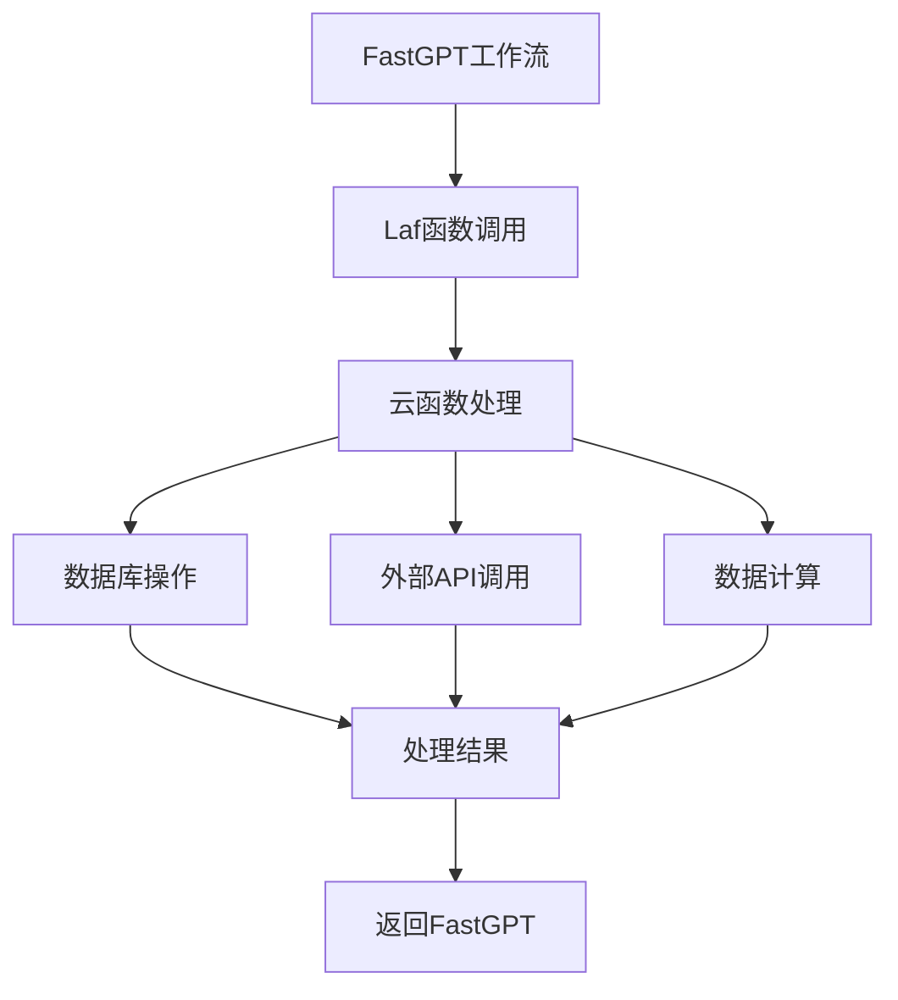
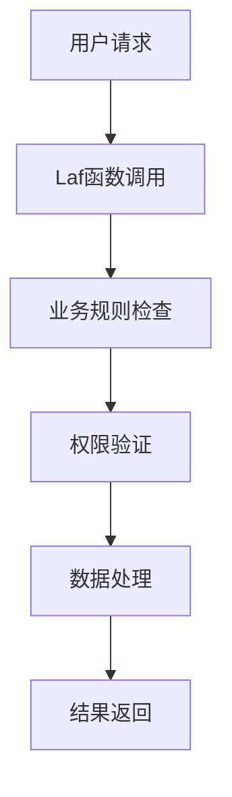
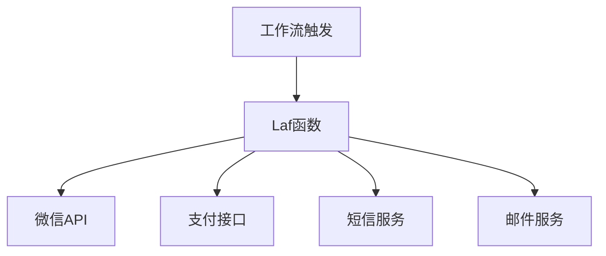

# Laf 函数调用

<!-- Laf函数调用模块界面图 -->

## 介绍

`Laf 函数调用`模块可以调用 Laf 账号下的云函数，其工作原理与 HTTP 模块相同，有以下特殊特征：

- 只能使用 POST 请求
- 请求自带系统参数 systemParams，无需通过变量传递

## 绑定 Laf 账号

要调用 Laf 云函数，首先需要绑定 Laf 账号和应用，并且在应用中创建云函数。

Laf 提供了 PAT(访问凭证) 来实现 Laf 平台外的快捷登录，可以访问 [Laf 文档](https://doc.laf.run/zh/cli/#%E7%99%BB%E5%BD%95)查看详细如何获取 PAT。

在获取到 PAT 后，我们可以进入 FastGPT 的`账号页`或是在高级编排中的 `Laf模块` 对 Laf 账号进行绑定。Laf 账号是团队共享的，仅团队管理员可配置。

填入 PAT 验证后，选择需要绑定的应用（应用需要是 Running 状态），即可调用该应用下的云函数。

<!-- Laf账号绑定图 -->

## 什么是 Laf

[Laf](https://laf.dev/) 是一个开源的云开发平台，提供了开箱即用的云函数、云数据库、云存储等能力，无需运维部署。

### Laf 的优势

- **免费使用**：提供免费的基础配额
- **快速开发**：在线编辑器，即写即发
- **无服务器**：无需关心服务器运维
- **多语言支持**：支持 JavaScript、TypeScript 等
- **丰富生态**：集成了多种数据库和第三方服务

## 使用场景

### 数据处理

通过 Laf 云函数处理复杂的数据逻辑：



### 业务逻辑

实现复杂的业务逻辑处理：



### 第三方集成

通过 Laf 集成第三方服务：



## 云函数示例

### 用户信息查询

```javascript
// 查询用户信息的云函数
export default async function (ctx: FunctionContext) {
  const { userId } = ctx.body;
  
  if (!userId) {
    return {
      success: false,
      message: '用户ID不能为空'
    };
  }
  
  try {
    // 查询数据库
    const db = cloud.database();
    const result = await db.collection('users')
      .where({ _id: userId })
      .get();
    
    if (result.data.length === 0) {
      return {
        success: false,
        message: '用户不存在'
      };
    }
    
    const user = result.data[0];
    return {
      success: true,
      data: {
        name: user.name,
        email: user.email,
        phone: user.phone,
        level: user.level
      }
    };
  } catch (error) {
    return {
      success: false,
      message: '查询失败',
      error: error.message
    };
  }
}
```

### 订单处理

```javascript
// 订单处理云函数
export default async function (ctx: FunctionContext) {
  const { orderId, action } = ctx.body;
  
  const db = cloud.database();
  
  try {
    switch (action) {
      case 'create':
        // 创建订单
        const newOrder = await db.collection('orders').add({
          ...ctx.body.orderData,
          status: 'pending',
          createdAt: new Date()
        });
        return { success: true, orderId: newOrder.id };
        
      case 'update':
        // 更新订单状态
        await db.collection('orders')
          .doc(orderId)
          .update({
            status: ctx.body.status,
            updatedAt: new Date()
          });
        return { success: true, message: '订单更新成功' };
        
      case 'cancel':
        // 取消订单
        await db.collection('orders')
          .doc(orderId)
          .update({
            status: 'cancelled',
            cancelledAt: new Date()
          });
        return { success: true, message: '订单已取消' };
        
      default:
        return { success: false, message: '不支持的操作' };
    }
  } catch (error) {
    return {
      success: false,
      message: '操作失败',
      error: error.message
    };
  }
}
```

### 数据统计

```javascript
// 数据统计云函数
export default async function (ctx: FunctionContext) {
  const { startDate, endDate, type } = ctx.body;
  
  const db = cloud.database();
  
  try {
    let collection, pipeline;
    
    switch (type) {
      case 'user_stats':
        // 用户统计
        pipeline = [
          {
            $match: {
              createdAt: {
                $gte: new Date(startDate),
                $lte: new Date(endDate)
              }
            }
          },
          {
            $group: {
              _id: { $dateToString: { format: "%Y-%m-%d", date: "$createdAt" } },
              count: { $sum: 1 }
            }
          },
          { $sort: { _id: 1 } }
        ];
        collection = 'users';
        break;
        
      case 'order_stats':
        // 订单统计
        pipeline = [
          {
            $match: {
              createdAt: {
                $gte: new Date(startDate),
                $lte: new Date(endDate)
              }
            }
          },
          {
            $group: {
              _id: { $dateToString: { format: "%Y-%m-%d", date: "$createdAt" } },
              count: { $sum: 1 },
              totalAmount: { $sum: "$amount" }
            }
          },
          { $sort: { _id: 1 } }
        ];
        collection = 'orders';
        break;
        
      default:
        return { success: false, message: '不支持的统计类型' };
    }
    
    const result = await db.collection(collection).aggregate(pipeline).end();
    
    return {
      success: true,
      data: result.list
    };
  } catch (error) {
    return {
      success: false,
      message: '统计失败',
      error: error.message
    };
  }
}
```

## 最佳实践

### 错误处理

```javascript
export default async function (ctx: FunctionContext) {
  try {
    // 业务逻辑
    const result = await processData(ctx.body);
    return { success: true, data: result };
  } catch (error) {
    console.error('处理错误:', error);
    return {
      success: false,
      message: error.message || '处理失败',
      code: error.code || 'UNKNOWN_ERROR'
    };
  }
}
```

### 参数验证

```javascript
export default async function (ctx: FunctionContext) {
  const { name, email, phone } = ctx.body;
  
  // 参数验证
  if (!name || !email) {
    return {
      success: false,
      message: '姓名和邮箱为必填项'
    };
  }
  
  if (!/\S+@\S+\.\S+/.test(email)) {
    return {
      success: false,
      message: '邮箱格式不正确'
    };
  }
  
  // 处理逻辑...
}
```

### 性能优化

```javascript
export default async function (ctx: FunctionContext) {
  // 使用连接池
  const db = cloud.database();
  
  // 批量操作
  const operations = ctx.body.operations;
  const results = await Promise.all(
    operations.map(op => processOperation(op))
  );
  
  // 缓存结果
  await cloud.storage.cache.set(
    `result_${ctx.body.requestId}`,
    results,
    { ttl: 3600 } // 1小时过期
  );
  
  return { success: true, data: results };
}
```

## 注意事项

1. **请求方式**：Laf 函数调用只支持 POST 请求
2. **参数传递**：系统参数会自动传递，无需手动配置
3. **超时设置**：注意设置合理的超时时间，避免长时间等待
4. **错误处理**：在云函数中做好错误处理，返回标准化的响应格式
5. **安全考虑**：敏感操作要做好权限验证和数据校验
6. **成本控制**：注意云函数的调用频率和资源消耗

## 相关链接

- [Laf 官方网站](https://laf.dev/)
- [Laf 官方文档](https://doc.laf.run/)
- [云函数开发指南](https://doc.laf.run/zh/guide/function/)
- [数据库操作文档](https://doc.laf.run/zh/guide/database/)
