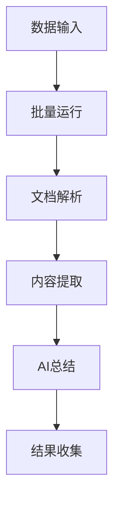
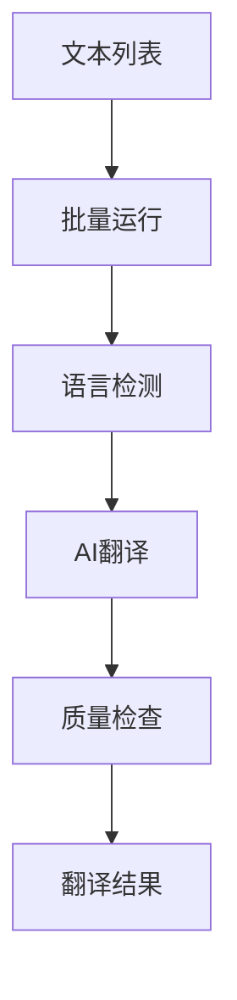

# 批量运行

## 节点概述

【**批量运行**】节点是 FastGPT V4.8.11 版本新增的一个重要功能模块。它允许工作流对数组类型的输入数据进行迭代处理，每次处理数组中的一个元素，并自动执行后续节点，直到完成整个数组的处理。

这个节点的设计灵感来自编程语言中的循环结构，但以可视化的方式呈现。

<!-- 批量运行节点界面图 -->

> 在程序中，节点可以理解为一个个 Function 或者接口。可以理解为它就是一个**步骤**。将多个节点一个个拼接起来，即可一步步的去实现最终的 AI 输出。

【**批量运行**】节点本质上也是一个 Function，它的主要职责是自动化地重复执行特定的工作流程。

## 核心特性

1. **数组批量处理**
   - 支持输入数组类型数据
   - 自动遍历数组元素
   - 保持处理顺序
   - 支持并行处理 (性能优化)

2. **自动迭代执行**
   - 自动触发后续节点
   - 支持条件终止
   - 支持循环计数
   - 维护执行上下文

3. **与其他节点协同**
   - 支持与 AI 对话节点配合
   - 支持与 HTTP 节点配合
   - 支持与内容提取节点配合
   - 支持与判断器节点配合

## 应用场景

【**批量运行**】节点的主要作用是通过自动化的方式扩展工作流的处理能力，使 FastGPT 能够更好地处理批量任务和复杂的数据处理流程。特别是在处理大规模数据或需要多轮迭代的场景下，批量运行节点能显著提升工作流的效率和自动化程度。

【**批量运行**】节点特别适合以下场景：

1. **批量数据处理**
   - 批量翻译文本
   - 批量总结文档
   - 批量分析数据
   - 批量格式转换

2. **数据清洗和转换**
   - 清理重复数据
   - 标准化数据格式
   - 数据验证和校正
   - 数据分类和标记

3. **自动化工作流**
   - 自动生成报告
   - 自动发送邮件
   - 自动更新数据库
   - 自动化测试流程

## 配置说明

### 输入配置

- **数组数据**：需要批量处理的数组数据
- **处理模式**：串行或并行处理
- **错误处理**：遇到错误时的处理策略
- **超时设置**：单个元素处理的超时时间

### 输出配置

- **处理结果**：每个元素的处理结果集合
- **执行状态**：批量处理的整体状态
- **错误信息**：处理过程中的错误记录
- **统计信息**：处理数量、成功率等统计数据

## 使用示例

### 批量文档处理

### 批量翻译流程

## 最佳实践

1. **合理控制批量大小**：避免一次处理过多数据导致系统压力过大
2. **设置适当超时**：根据单个任务的复杂度设置合理的超时时间
3. **错误处理策略**：制定清晰的错误处理和重试机制
4. **监控和日志**：记录处理过程和结果，便于调试和优化
5. **资源管理**：注意API调用频率和成本控制
