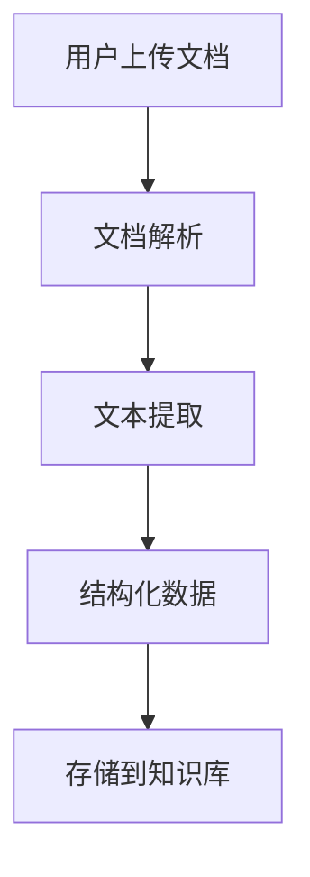
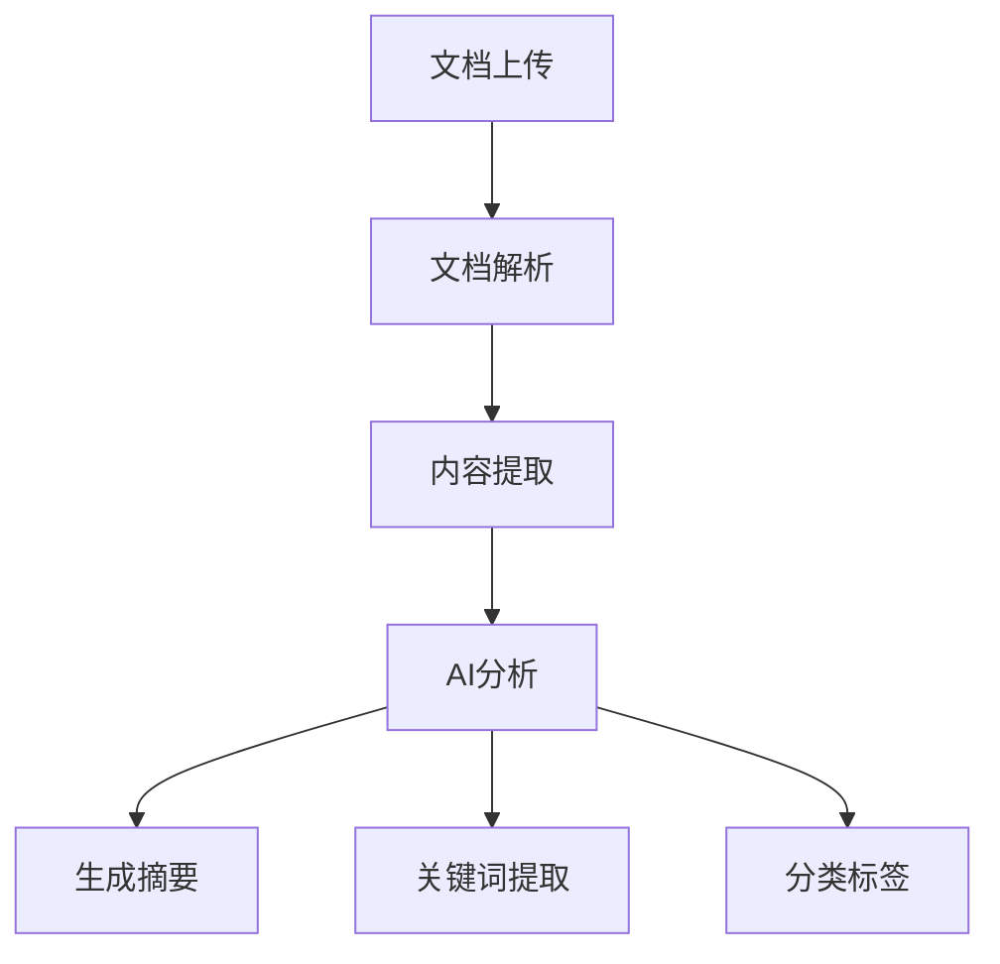
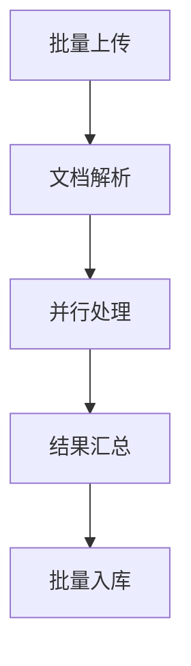
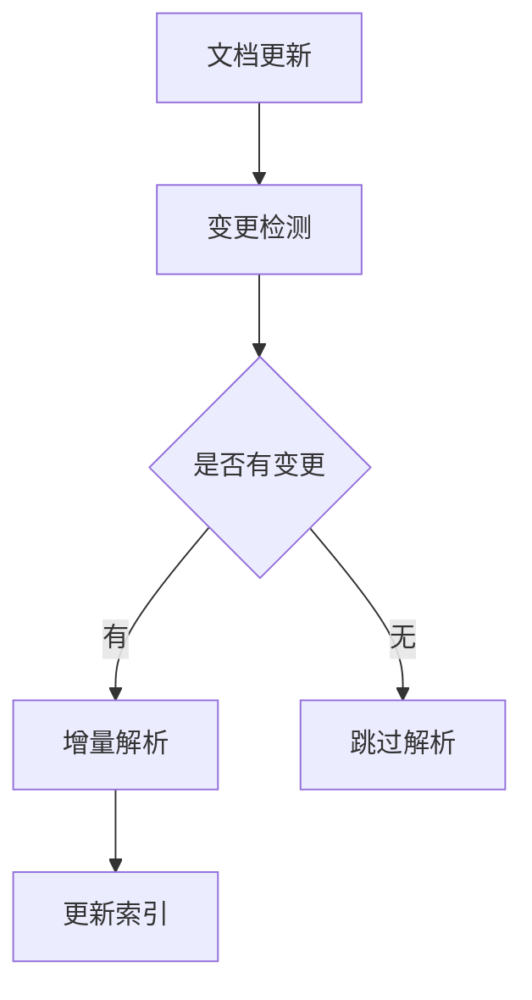

# 文档解析

<!-- 文档解析界面图 -->

开启文件上传后，可使用文档解析组件。

## 功能

文档解析组件能够自动识别和解析用户上传的各种格式文档，提取其中的文本内容和结构化信息。

## 支持的文档格式

### 文档类型

- **PDF文档**：支持文本PDF和扫描PDF
- **Word文档**：.doc、.docx格式
- **Excel表格**：.xls、.xlsx格式
- **PowerPoint**：.ppt、.pptx格式
- **文本文件**：.txt、.md、.csv格式
- **图片文件**：.jpg、.png、.gif（需要OCR识别）

### 特殊处理

- **扫描文档**：使用OCR技术识别图片中的文字
- **表格数据**：保持表格结构，支持结构化提取
- **多页文档**：支持多页文档的批量处理
- **混合内容**：处理包含文字、图片、表格的复合文档

## 使用场景

### 文档数字化

将纸质文档转换为数字化内容：



### 内容分析

对文档内容进行智能分析：



### 批量处理

批量处理多个文档：



## 解析配置

### 解析选项

- **文本提取模式**：纯文本、保留格式、结构化提取
- **OCR配置**：语言设置、识别精度、字体优化
- **表格处理**：保留表格结构、转换为文本、提取数据
- **图片处理**：是否提取图片描述、图片文字识别

### 输出格式

- **纯文本**：提取的纯文本内容
- **Markdown**：保留格式的Markdown文本
- **JSON**：结构化的JSON数据
- **HTML**：带格式的HTML内容

## 配置示例

### 基础文本提取

```json
{
  "extractMode": "text",
  "preserveFormat": false,
  "includeImages": false,
  "tableHandling": "text"
}
```

### 结构化提取

```json
{
  "extractMode": "structured",
  "preserveFormat": true,
  "includeImages": true,
  "tableHandling": "structured",
  "outputFormat": "json"
}
```

### OCR配置

```json
{
  "ocrEnabled": true,
  "ocrLanguage": ["zh-cn", "en"],
  "ocrAccuracy": "high",
  "imagePreprocessing": true
}
```

## 解析结果

### 文本内容

```json
{
  "content": "提取的文本内容",
  "wordCount": 1234,
  "pageCount": 5,
  "language": "zh-cn"
}
```

### 结构化数据

```json
{
  "title": "文档标题",
  "headings": [
    {"level": 1, "text": "第一章"},
    {"level": 2, "text": "1.1 概述"}
  ],
  "tables": [
    {
      "headers": ["列1", "列2"],
      "rows": [["数据1", "数据2"]]
    }
  ],
  "images": [
    {
      "position": "page_1",
      "description": "图片描述",
      "text": "图片中的文字"
    }
  ]
}
```

### 元数据

```json
{
  "fileName": "document.pdf",
  "fileSize": 1024000,
  "mimeType": "application/pdf",
  "createdDate": "2024-01-01",
  "modifiedDate": "2024-01-02",
  "author": "作者名称",
  "pageCount": 10
}
```

## 质量优化

### 文档预处理

1. **文件格式转换**：将各种格式统一转换为标准格式
2. **图像预处理**：调整对比度、降噪、旋转矫正
3. **分辨率优化**：提高扫描文档的清晰度
4. **版面分析**：识别文档的版面结构和阅读顺序

### 识别优化

1. **多引擎融合**：结合多种OCR引擎提高准确率
2. **后处理纠错**：使用词典和语言模型纠正识别错误
3. **版面保持**：保持原文档的版面格式和结构
4. **表格重建**：准确识别和重建表格结构

## 最佳实践

### 文档准备

1. **文档质量**：确保文档清晰、完整、无损坏
2. **格式选择**：优先选择文本型PDF而非扫描PDF
3. **文件大小**：控制单个文件大小，避免超时
4. **命名规范**：使用有意义的文件名便于管理

### 参数调优

1. **根据需求选择模式**：文本提取还是结构化解析
2. **OCR精度平衡**：平衡识别精度和处理速度
3. **输出格式选择**：根据后续处理需求选择合适格式
4. **错误处理**：设置合理的错误处理和重试机制

### 性能优化

1. **批量处理**：合理安排批量处理的文档数量
2. **缓存机制**：对重复文档使用缓存避免重复解析
3. **异步处理**：对大文件使用异步处理避免阻塞
4. **资源监控**：监控CPU、内存使用情况

## 高级功能

### 智能分类

自动识别文档类型并应用不同的解析策略：

```javascript
// 示例：根据文档类型选择解析策略
function selectParseStrategy(document) {
  if (document.type === 'contract') {
    return {
      extractSignatures: true,
      identifyParties: true,
      extractDates: true
    };
  } else if (document.type === 'report') {
    return {
      extractCharts: true,
      preserveStructure: true,
      summarizeContent: true
    };
  }
}
```

### 增量解析

支持文档的增量更新和解析：



### 多语言支持

支持多语言文档的混合解析：

- **语言检测**：自动检测文档语言
- **混合语言**：处理包含多种语言的文档
- **翻译集成**：可选的自动翻译功能
- **编码处理**：正确处理各种字符编码

## 注意事项

1. **文件大小限制**：注意系统对文件大小的限制
2. **处理时间**：大文档可能需要较长处理时间
3. **格式支持**：确认文档格式在支持范围内
4. **字符编码**：注意处理特殊字符和编码问题
5. **版权问题**：注意文档的版权和隐私保护
6. **质量评估**：对解析结果进行质量评估和人工校验
