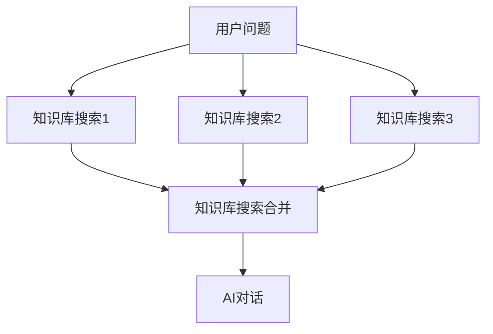
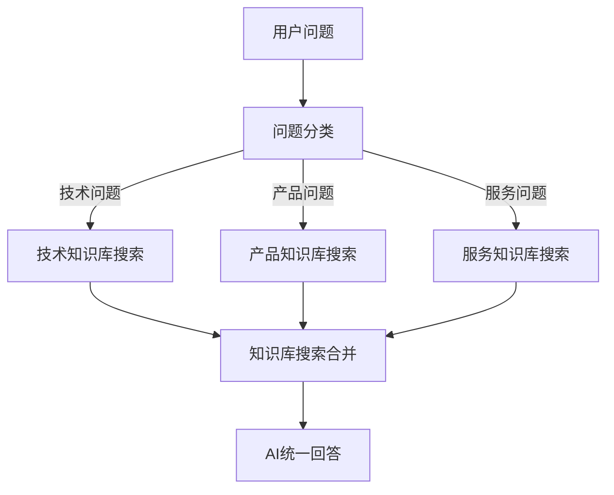
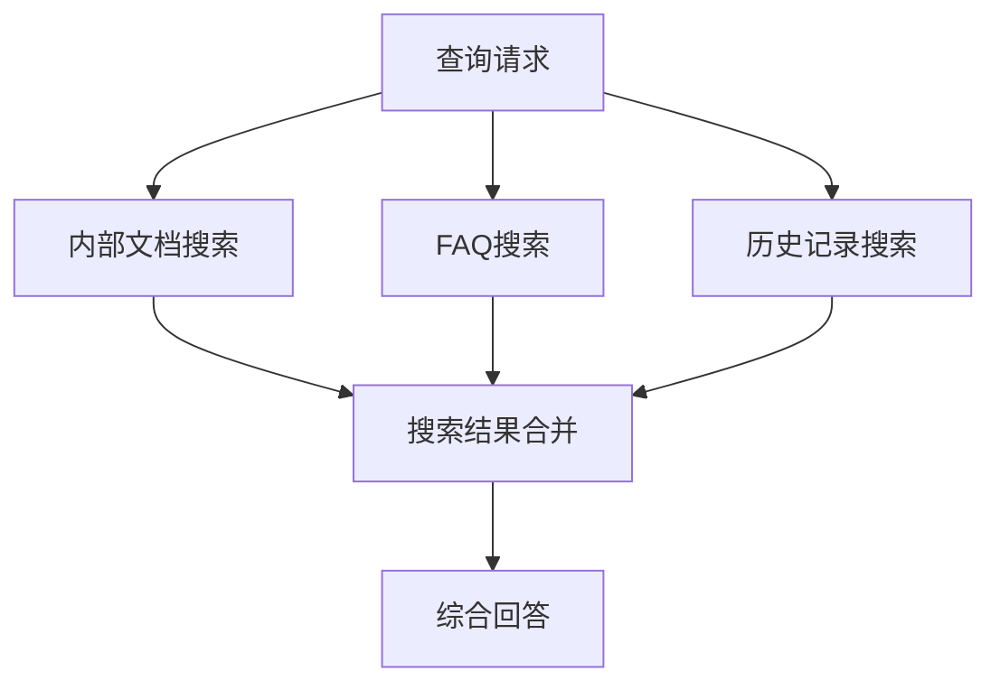

# 知识库搜索引用合并

<!-- 知识库合并模块界面图 -->

## 作用

将多个知识库搜索结果合并成一个结果进行输出，并会通过 RRF 进行重新排序（根据排名情况），并且支持最大 tokens 过滤。

## 使用方法

AI对话只能接收一个知识库引用内容。因此，如果调用了多个知识库，无法直接引用所有知识库。

<!-- 多知识库问题图 -->

使用**知识库搜索引用合并**，可以把多个知识库的搜索结果合在一起。

<!-- 知识库合并方案图 -->

## 使用场景

### 多知识库整合

当需要从多个知识库中检索信息并统一处理时：



### 分类检索合并

经过问题分类后对不同知识库进行检索，然后统一给一个 AI 进行回答：



### 多数据源整合

整合来自不同数据源的信息：



## 功能特性

### RRF 重新排序

使用 Reciprocal Rank Fusion (RRF) 算法对来自不同知识库的搜索结果进行重新排序：

- **排名融合**：综合考虑各个知识库中的排名情况
- **相关性优化**：提高最相关内容的排序位置
- **去重处理**：自动去除重复或相似的搜索结果
- **权重平衡**：平衡不同知识库的重要性

### Token 过滤

支持最大 tokens 限制，确保合并结果不超过模型处理能力：

- **智能截断**：按相关性优先保留重要内容
- **长度控制**：控制合并后的总文本长度
- **质量保证**：优先保留高质量的搜索结果
- **性能优化**：避免过长文本影响处理速度

## 配置说明

### 输入配置

- **知识库搜索结果**：连接多个知识库搜索节点
- **合并策略**：选择合并和排序策略
- **权重设置**：为不同知识库设置权重比例

### 输出配置

- **最大 Tokens**：设置合并结果的最大长度
- **最大条目数**：限制合并结果的条目数量
- **去重阈值**：设置内容去重的相似度阈值
- **格式化选项**：选择输出格式和结构

## 最佳实践

### 知识库选择

1. **相关性匹配**：选择与查询主题相关的知识库
2. **互补性考虑**：选择内容互补而非重复的知识库
3. **质量优先**：优先选择高质量、更新及时的知识库
4. **数量适中**：避免合并过多知识库影响效果

### 权重配置

1. **权威性权重**：为权威性更高的知识库设置更高权重
2. **时效性权重**：为更新更及时的知识库增加权重
3. **专业性权重**：根据查询类型调整专业知识库权重
4. **动态调整**：根据使用效果动态调整权重配置

### 性能优化

1. **合理限制**：设置合理的 token 和条目限制
2. **缓存策略**：对常见查询进行结果缓存
3. **并行处理**：支持多个知识库并行搜索
4. **监控优化**：监控合并效果并持续优化

## 高级应用

### 多模态知识库

整合不同类型的知识库：

- **文本知识库**：文档、FAQ、手册等
- **结构化数据**：数据库、表格等
- **多媒体内容**：图片描述、视频字幕等
- **实时数据**：API接口、动态内容等

### 个性化合并

根据用户特征进行个性化合并：

```javascript
// 示例：根据用户类型调整知识库权重
if (用户类型 === "技术用户") {
  技术知识库权重 = 0.6;
  产品知识库权重 = 0.3;
  营销知识库权重 = 0.1;
} else if (用户类型 === "商务用户") {
  技术知识库权重 = 0.2;
  产品知识库权重 = 0.4;
  营销知识库权重 = 0.4;
}
```

### 质量评估

对合并结果进行质量评估：

- **相关性评分**：评估结果与查询的相关性
- **完整性检查**：确保关键信息的完整性
- **一致性验证**：检查不同来源信息的一致性
- **用户反馈**：收集用户对结果质量的反馈

## 注意事项

1. **内容冲突**：注意处理不同知识库中可能存在的冲突信息
2. **版本控制**：确保各个知识库的版本同步和更新
3. **访问权限**：考虑不同知识库的访问权限和安全要求
4. **成本控制**：合并操作可能增加计算成本，需要合理控制
5. **效果监控**：定期监控合并效果，优化配置参数
