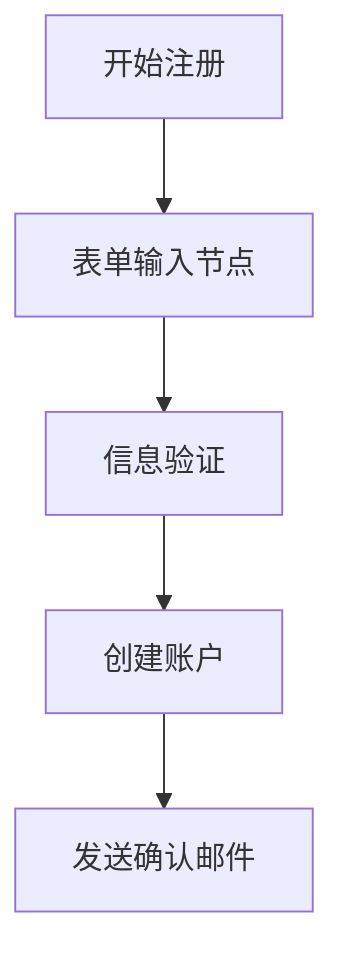
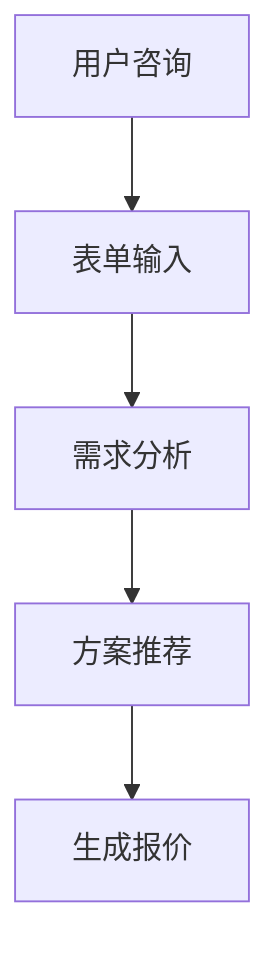
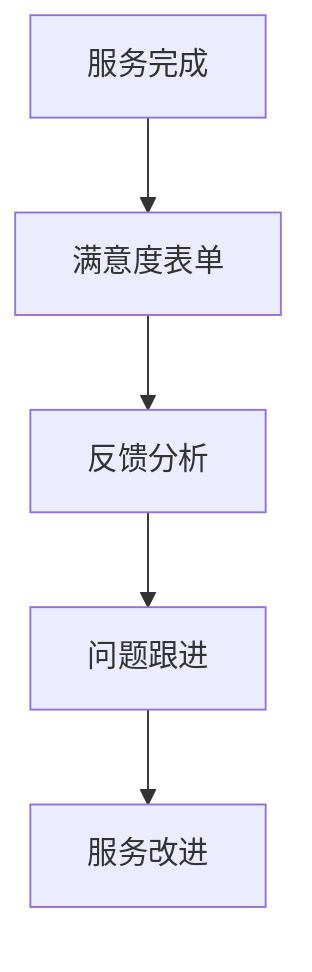
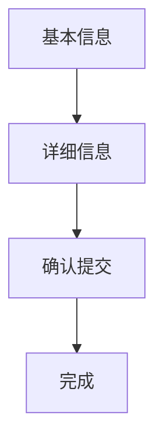

# 表单输入

## 特点 

- 用户交互
- 可重复添加
- 触发执行

<!-- 表单输入模块界面图 -->

## 功能 

「表单输入」节点属于用户交互节点，当触发这个节点时，对话会进入"交互"状态，会记录工作流的状态，等用户完成交互后，继续向下执行工作流。

<!-- 表单状态图 -->

当触发表单输入节点时，对话框隐藏，对话进入"交互状态"。

<!-- 表单提交图 -->

当用户填完必填的信息并点击提交后，节点能够收集用户填写的表单信息，传递到后续的节点中使用。

## 作用

能够精准收集需要的用户信息，再根据用户信息进行后续操作。

## 使用场景

### 用户注册

收集用户注册信息：



### 需求收集

收集用户具体需求信息：



### 反馈收集

收集用户反馈和建议：



## 表单字段类型

### 文本输入

- **单行文本**：姓名、邮箱等简短信息
- **多行文本**：详细描述、意见建议等
- **数字输入**：年龄、数量等数值信息
- **邮箱格式**：自动验证邮箱格式的输入框

### 选择输入

- **单选按钮**：性别、优先级等单选项
- **多选框**：兴趣爱好、技能等多选项
- **下拉选择**：地区、职业等选择项
- **日期选择**：生日、时间等日期信息

### 特殊输入

- **文件上传**：附件、图片等文件
- **评分组件**：满意度、评价等打分
- **开关按钮**：同意条款、接收通知等
- **隐藏字段**：传递系统信息的隐藏值

## 配置说明

### 字段配置

- **字段名称**：表单字段的标识名
- **显示标签**：用户看到的字段名称
- **字段类型**：选择合适的输入类型
- **是否必填**：设置字段的必填状态
- **默认值**：字段的初始值
- **验证规则**：输入格式的验证要求
- **提示信息**：帮助用户填写的说明文字

### 表单设置

- **表单标题**：表单的主标题
- **说明文字**：表单用途和填写说明
- **提交按钮**：自定义提交按钮文字
- **样式配置**：表单的视觉样式设置

## 验证规则

### 常用验证

- **必填验证**：确保重要字段不为空
- **格式验证**：邮箱、手机号等格式检查
- **长度限制**：文本最小/最大长度限制
- **数值范围**：数字的最小/最大值限制

### 自定义验证

- **正则表达式**：自定义格式验证规则
- **关联验证**：多个字段之间的关联检查
- **远程验证**：调用API进行实时验证
- **条件验证**：根据其他字段值进行条件验证

## 最佳实践

1. **表单简洁**：只收集必要的信息，避免表单过长
2. **逻辑清晰**：字段排列要符合用户填写习惯
3. **验证及时**：在用户输入时即时反馈验证结果
4. **错误提示**：提供清晰的错误提示和修改建议
5. **移动适配**：确保在移动设备上的良好体验
6. **数据安全**：敏感信息要加密传输和存储

## 高级功能

### 动态表单

根据用户选择动态显示或隐藏字段：

```javascript
// 示例：根据用户类型显示不同字段
if (userType === "企业用户") {
  显示("公司名称", "营业执照");
  隐藏("个人身份证");
} else {
  显示("个人身份证");
  隐藏("公司名称", "营业执照");
}
```

### 分步表单

将复杂表单分解为多个步骤：



### 表单联动

多个表单字段之间的联动关系：

- 省市区三级联动
- 根据产品类型显示相关配置项
- 价格根据选项自动计算
