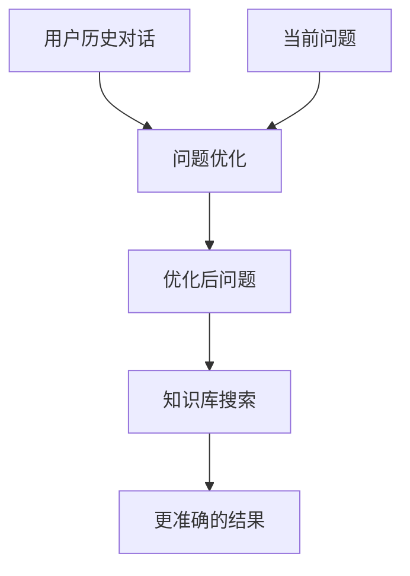
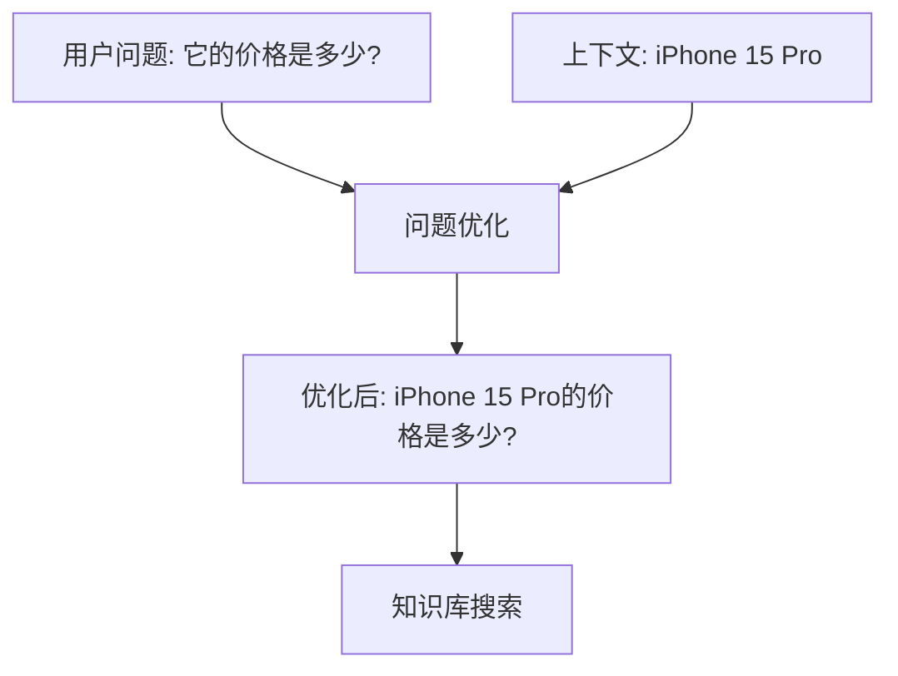
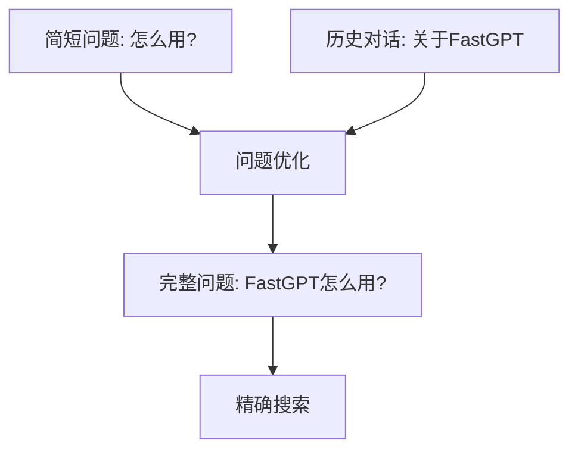

# 问题优化

## 特点

- 可重复添加
- 有外部输入
- 触发执行

<!-- 问题优化模块界面图 -->

## 背景

在 RAG 中，我们需要根据输入的问题去数据库里执行 embedding 搜索，查找相关的内容，从而查找到相似的内容（简称知识库搜索）。

在搜索的过程中，尤其是连续对话的搜索，我们通常会发现后续的问题难以搜索到合适的内容，其中一个原因是知识库搜索只会使用"当前"的问题去执行。

<!-- 指代问题示例图 -->

用户在提问"第二点是什么"的时候，只会去知识库里查找"第二点是什么"，压根查不到内容。实际上需要查询的是"QA结构是什么"。因此我们需要引入一个【问题优化】模块，来对用户当前的问题进行补全，从而使得知识库搜索能够搜索到合适的内容。

<!-- 优化后效果图 -->

## 功能

调用 AI 去对用户当前的问题进行补全。目前主要是补全"指代"词，使得检索词更加的完善可靠，从而增强上下文连续对话的知识库搜索能力。

遇到最大的难题在于：模型对于【补全】的概念可能不清晰，且对于长上下文往往无法准确的知道应该如何补全。

## 使用场景

### 连续对话优化

在多轮对话中优化问题表达：



### 指代消解

解决问题中的指代关系：



### 上下文补全

补全缺失的上下文信息：



## 优化策略

### 指代词处理

识别并替换常见的指代词：

- **人称代词**：他、她、它 → 具体的人名或物品
- **指示代词**：这个、那个、此 → 具体的对象
- **疑问代词**：什么、哪个 → 结合上下文的具体内容

### 省略补全

补全省略的关键信息：

- **主语省略**：补全缺失的主语
- **宾语省略**：补全缺失的宾语  
- **修饰词省略**：补全重要的修饰信息

### 上下文整合

将当前问题与历史对话整合：

- **话题连续性**：保持话题的连续性
- **信息累积**：整合历史信息
- **语义一致性**：确保语义的一致性

## 配置说明

### 优化模式

- **简单模式**：只处理明显的指代词
- **标准模式**：处理指代词和简单省略
- **增强模式**：深度理解和上下文整合

### 上下文设置

- **历史轮数**：使用多少轮历史对话
- **重点信息**：标记重点关注的信息
- **过滤规则**：过滤无关的历史信息

### 优化规则

- **指代映射**：设置指代词的映射规则
- **关键词保留**：保留重要的关键词
- **格式标准化**：标准化问题格式

## 实际应用示例

### 产品咨询场景

**对话历史：**
```
用户：介绍一下iPhone 15 Pro
客服：iPhone 15 Pro是苹果最新旗舰手机...
用户：它的价格是多少？
```

**优化过程：**
```
原问题：它的价格是多少？
上下文分析：上一轮提到了"iPhone 15 Pro"
优化结果：iPhone 15 Pro的价格是多少？
```

### 技术支持场景

**对话历史：**
```
用户：FastGPT如何创建知识库？
客服：创建知识库的步骤是...
用户：第二步怎么操作？
```

**优化过程：**
```
原问题：第二步怎么操作？
上下文分析：讨论的是"FastGPT创建知识库"的步骤
优化结果：FastGPT创建知识库的第二步怎么操作？
```

### 教育咨询场景

**对话历史：**
```
用户：机器学习有哪些算法？
老师：主要有监督学习、无监督学习...
用户：监督学习包括什么？
老师：包括线性回归、决策树...
用户：决策树的优缺点呢？
```

**优化过程：**
```
原问题：决策树的优缺点呢？
上下文分析：讨论的是"机器学习监督学习算法中的决策树"
优化结果：机器学习中决策树算法的优缺点是什么？
```

## 优化效果评估

### 搜索准确率

对比优化前后的搜索结果质量：

- **相关性提升**：搜索结果的相关性得分
- **召回率改善**：能够找到相关内容的比例
- **用户满意度**：用户对回答质量的评价

### 对话连贯性

评估对话的连贯性改善：

- **上下文理解**：AI对上下文的理解程度
- **回答一致性**：多轮对话中回答的一致性
- **话题保持**：话题跳转的合理性

## 最佳实践

### 提示词设计

设计有效的优化提示词：

```
你是一个问题优化专家，请根据对话历史优化用户的当前问题。

优化目标：
1. 补全指代词和省略的信息
2. 保持问题的核心意图不变
3. 让问题更适合知识库搜索

对话历史：
{{对话历史}}

当前问题：{{当前问题}}

请输出优化后的问题：
```

### 上下文管理

合理管理上下文信息：

1. **关键信息提取**：提取对话中的关键实体和概念
2. **权重分配**：为不同轮次的对话分配权重
3. **噪音过滤**：过滤无关的对话内容
4. **长度控制**：控制上下文的长度避免过长

### 质量控制

确保优化质量：

1. **变化检测**：检测问题是否真的需要优化
2. **过度优化避免**：避免过度修改原始问题
3. **意图保持**：确保优化后问题的意图不变
4. **A/B测试**：对比优化效果

## 高级技巧

### 实体链接

将指代词链接到具体实体：

```javascript
// 示例：实体链接逻辑
const entities = extractEntities(conversationHistory);
const pronouns = findPronouns(currentQuestion);

pronouns.forEach(pronoun => {
  const linkedEntity = linkToEntity(pronoun, entities);
  if (linkedEntity) {
    currentQuestion = currentQuestion.replace(pronoun, linkedEntity);
  }
});
```

### 意图保持

确保优化过程中意图不丢失：

```
原始意图分析：用户想了解价格信息
指代对象识别：iPhone 15 Pro
意图保持检查：优化后问题是否还在询问价格
结果验证：iPhone 15 Pro的价格是多少？
```

### 多策略融合

结合多种优化策略：

1. **规则匹配**：基于规则的指代词替换
2. **语义理解**：基于语义的上下文理解
3. **模板填充**：使用预定义模板优化问题
4. **机器学习**：使用训练好的模型进行优化

## 注意事项

1. **优化边界**：不要过度优化，保持问题的自然性
2. **计算成本**：问题优化会增加API调用成本
3. **延迟影响**：优化过程会增加响应延迟
4. **质量监控**：需要监控优化质量避免错误优化
5. **用户体验**：平衡优化效果和用户等待时间
6. **场景适应**：不同场景可能需要不同的优化策略
