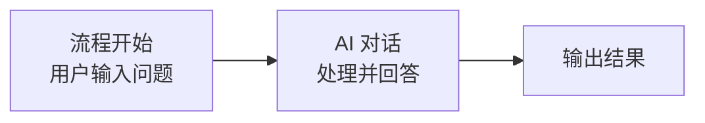
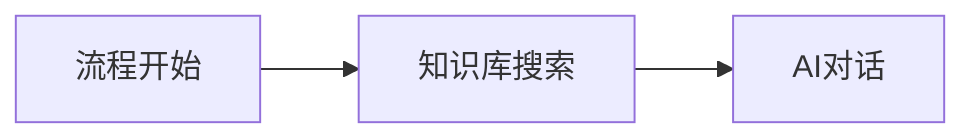
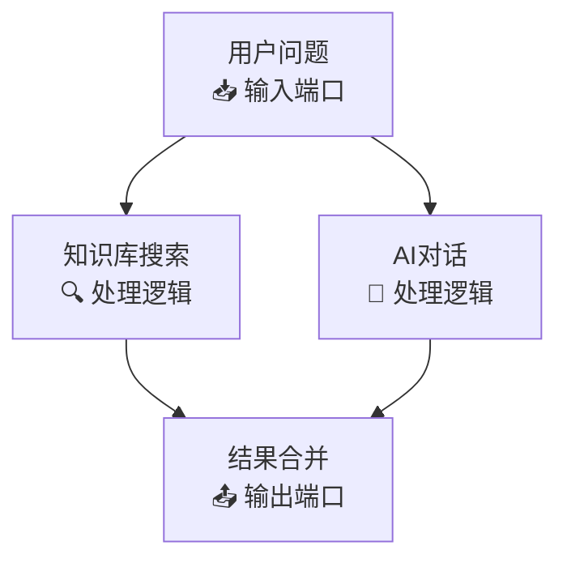
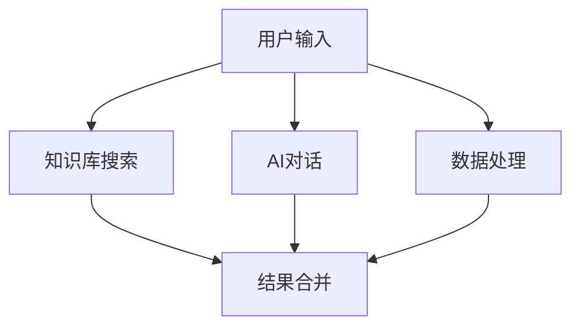
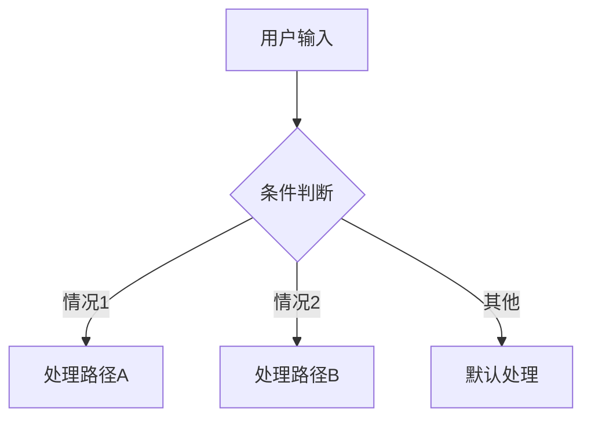
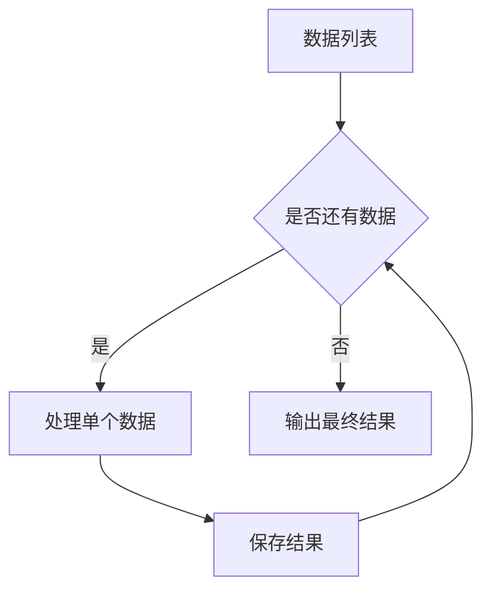

# 工作流&插件详解

快速了解 FastGPT 工作流和插件的核心概念与使用方法。

## 概述

FastGPT 从 V4.0 版本开始采用新的交互方式来构建 AI 应用。使用了 **Flow 节点编排（工作流）** 的方式来实现复杂工作流，提高可玩性和扩展性。但同时也提高了上手的门槛，有一定开发背景的用户使用起来会比较容易。

:::tip 视频教程
查看 [官方视频教程](https://doc.fastgpt.cn/docs/introduction/guide/dashboard/intro) 获得更直观的学习体验。
:::

## 什么是节点？

在程序中，节点可以理解为一个个 **Function** 或者接口。可以理解为它就是一个**步骤**。将多个节点一个个拼接起来，即可一步步的去实现最终的 AI 输出。

### 基础示例

如下图，这是一个最简单的 AI 对话工作流，它由**流程开始**和 **AI 对话**节点组成：

**执行流程如下：**

1. **用户输入问题后**，【流程开始】节点执行，用户问题被保存
2. **【AI 对话】节点执行**，此节点有两个必填参数：
   - "聊天记录"：默认输入的6条，表示此模块上下文长度
   - "用户问题"：选择的是【流程开始】模块中保存的用户问题
3. **【AI 对话】节点**根据传入的聊天记录和用户问题，调用对话接口，从而实现回答

## 节点分类

从功能上，节点可以分为 2 类：

### 1. 系统节点
- **用户引导**：配置一些对话框信息
- **用户问题**：流程入口，接收用户输入

### 2. 功能节点
- **知识库搜索**：从知识库中检索相关信息
- **AI 对话**：调用大语言模型进行对话
- **HTTP 请求**：调用外部 API 接口
- **代码执行**：执行自定义代码逻辑
- **条件判断**：实现分支逻辑控制
- **文本处理**：文本格式化和转换
- **数据转换**：数据格式转换和处理

:::info 注意
功能节点都有输入和输出，可以自由组合使用。
:::

## 节点的组成

每个节点会包含 3 个核心部分：

### 1. 输入（Input）
- **AI模型**：选择使用的语言模型
- **提示词**：给AI的指令和上下文
- **聊天记录**：历史对话记录
- **用户问题**：当前用户输入
- **知识库引用**：从知识库检索的相关内容

输入可以是：
- **手动输入**：直接在节点中配置
- **变量引用**：引用全局变量或其他节点的输出

### 2. 输出（Output）
- **新的上下文**：更新后的对话上下文
- **AI回复内容**：模型生成的回答
- **检索结果**：知识库搜索的结果
- **处理状态**：执行结果状态信息

输出可以被后续任意节点变量引用。

### 3. 触发器（Trigger）
节点的上下左右有四个"触发器"可以被用来连接：
- **左侧和上侧**：前置连接点（输入触发）
- **右侧和下侧**：后置连接点（输出触发）

被连接的节点按顺序决定是否执行。

## 🔥 重点 - 工作流是如何运行的

FastGPT的工作流从【流程开始】节点开始执行，可以理解为从用户输入问题开始，**没有固定的出口**，是以节点运行结束作为出口。如果在一个轮调用中，所有节点都不再运行，则工作流结束。

### 连接线状态

FastGPT工作流中的线有以下几种状态：

| 状态 | 说明 | 图标 |
|------|------|------|
| `waiting` | 被连接的节点等待执行 | 🕐 |
| `active` | 被连接的节点可以执行 | ✅ |
| `skip` | 被连接的节点不需要执行跳过 | ⏭️ |

### 节点执行原则

1. **判断前置线状态**：
   - 如果有 `waiting` 状态的前置线 → 等待
   - 如果有 `active` 状态的前置线 → 执行
   - 如果既没有 `waiting` 也没有 `active` → 跳过此节点

2. **节点执行完毕后**：
   - 根据实际情况更改后置线状态为 `active` 或 `skip`
   - 更改前置线状态为 `waiting` 等待下一轮执行

### 执行示例

**执行过程：**

1. **【流程开始】** 节点执行完毕，更改后置线为 `active`
2. **【知识库搜索】** 节点判断前置线状态为 `active` 开始执行，执行完毕后：
   - 更改后置线状态为 `active`
   - 前置线状态为 `waiting`
3. **【AI对话】** 节点判断前置线状态为 `active` 开始执行，流程执行结束

## 如何连接节点

### 连接方式
1. **连接点位置**：每个节点的上下左右都有连接点
   - **左和上**：前置线连接点（输入）
   - **右和下**：后置线连接点（输出）

2. **操作方法**：
   - 点击源节点的输出连接点
   - 拖拽到目标节点的输入连接点
   - 释放鼠标完成连接

3. **管理连接**：
   - 点击连接线中间的 ❌ 删除连接线
   - 左键点击选中连接线进行编辑

### 连接示例

## 如何阅读工作流？

### 阅读顺序
1. **从左往右阅读**：按照数据流向理解逻辑
2. **从【用户问题】节点开始**：这是流程的入口点
3. **关注输出节点**：
   - **【AI 对话】节点**：AI生成的回答
   - **【指定回复】节点**：预设的固定回复

### 理解要点
- **数据流向**：了解数据如何在节点间传递
- **分支逻辑**：识别条件判断和分支处理
- **输出路径**：确认最终结果的输出方式

## FAQ

### Q: 想合并多个输出结果怎么实现？

**A: 有以下几种方法：**

1. **文本加工节点**：可以对字符串进行合并
2. **知识库搜索合并**：可以合并多个知识库搜索结果
3. **HTTP节点处理**：对于其他结果，无法直接合并时，可以考虑传入到 `HTTP` 节点中进行合并
4. **无服务器方案**：使用 [Laf](https://laf.run/) 可以快速实现一个无服务器HTTP接口

### Q: 节点执行失败怎么处理？

**A: 可以采用以下策略：**
- 添加错误处理节点
- 设置重试机制
- 配置降级方案
- 记录错误日志

### Q: 如何优化工作流性能？

**A: 性能优化建议：**
- 减少不必要的节点
- 合理使用并行处理
- 优化API调用频率
- 设置合理的超时时间

### Q: 支持哪些数据类型？

**A: 支持的数据类型：**
- 文本（String）
- 数字（Number）
- 布尔值（Boolean）
- 数组（Array）
- 对象（Object）
- 文件（File）

## 高级技巧

### 1. 并行处理
使用多个并行分支同时处理不同任务，提高效率：

### 2. 条件分支
根据不同条件执行不同的处理路径：

### 3. 循环处理
对批量数据进行循环处理：

---

*参考来源：[FastGPT 官方文档](https://doc.fastgpt.cn/docs/introduction/guide/dashboard/intro)*
