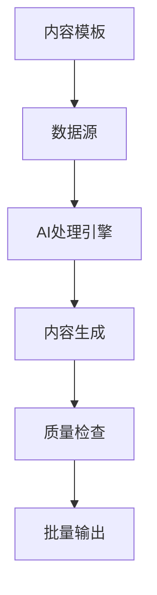
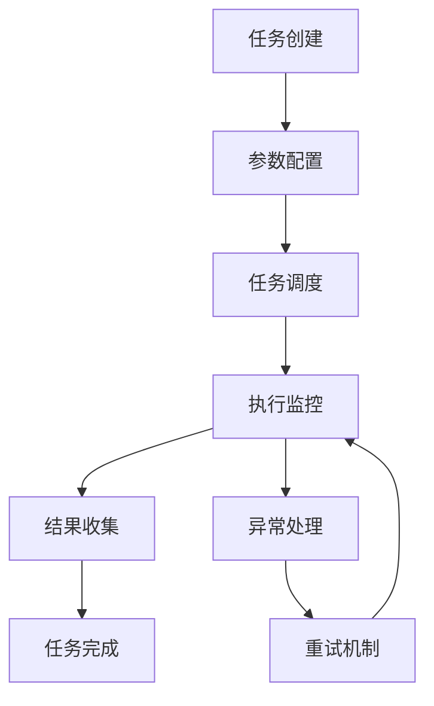
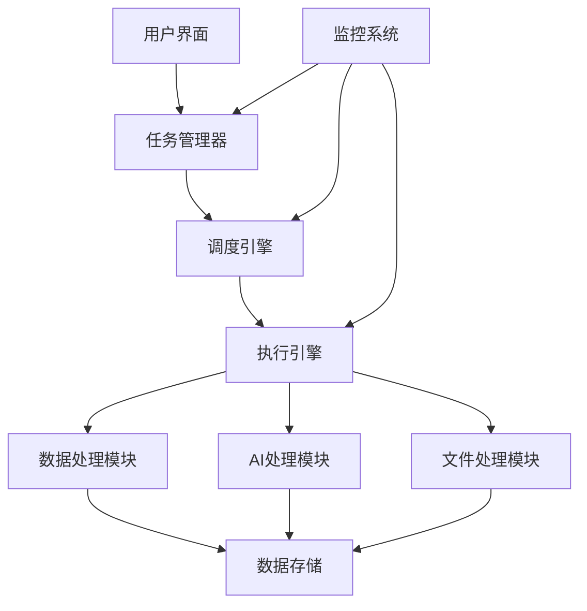

# 批量处理概述

FastGPT 批量处理功能详解，提升数据处理效率和自动化水平。

## 什么是批量处理

批量处理是 FastGPT 提供的一套自动化工具，允许用户一次性处理大量数据或执行重复性任务，大幅提升工作效率。

## 核心优势

### ⚡ 高效处理
- **并行执行**：支持多任务同时进行
- **智能调度**：自动优化任务执行顺序
- **资源管理**：合理分配系统资源
- **断点续传**：任务中断后可恢复执行

### 🔄 自动化流程
- **定时任务**：支持定时自动执行
- **条件触发**：基于特定条件自动启动
- **工作流集成**：与现有工作流无缝对接
- **状态监控**：实时监控任务执行状态

### 📊 数据处理
- **批量导入**：一次性导入大量数据
- **格式转换**：支持多种数据格式转换
- **质量检查**：自动验证数据质量
- **错误处理**：智能处理异常情况

## 主要功能模块

### 1. 批量数据导入

支持多种数据源的批量导入：


**支持的数据源：**
- 📄 **文档文件**：PDF、Word、Excel、TXT
- 🌐 **网页内容**：HTML、Markdown
- 📊 **结构化数据**：JSON、CSV、XML
- 🗄️ **数据库**：MySQL、PostgreSQL、MongoDB
- ☁️ **云存储**：阿里云OSS、腾讯云COS

### 2. 批量内容生成

基于模板和规则批量生成内容：



**生成类型：**
- 📝 **文本内容**：文章、摘要、标签
- 🔄 **数据转换**：格式转换、结构调整
- 🏷️ **自动标注**：分类标签、关键词提取
- 📋 **报告生成**：数据报告、分析总结

### 3. 批量任务管理

完整的任务生命周期管理：



**管理功能：**
- ⏰ **定时调度**：支持cron表达式定时执行
- 📈 **进度监控**：实时查看任务执行进度
- 🔔 **通知提醒**：任务完成或异常时自动通知
- 📜 **日志记录**：详细记录任务执行日志

## 应用场景

### 1. 知识库建设

快速构建大规模知识库：

#### 批量文档导入
- **企业文档库**：导入公司内部文档、手册、制度
- **技术资料库**：批量导入API文档、技术规范
- **产品知识库**：导入产品资料、用户手册

#### 内容标准化
- **格式统一**：将不同格式文档转换为统一格式
- **结构优化**：自动调整文档结构和层级
- **质量提升**：自动检查和修复内容问题

### 2. 数据迁移

高效完成系统间数据迁移：

#### 系统升级
- **版本迁移**：从旧版本迁移到新版本
- **平台切换**：跨平台数据迁移
- **数据整合**：多系统数据合并

#### 数据清洗
- **重复数据清理**：自动识别和处理重复内容
- **格式标准化**：统一数据格式和结构
- **质量提升**：修复数据质量问题

### 3. 内容生产

自动化内容生产流水线：

#### 营销内容
- **产品描述**：批量生成产品介绍和特性说明
- **营销文案**：基于模板生成营销材料
- **SEO内容**：批量生成搜索优化内容

#### 技术文档
- **API文档**：自动生成接口文档
- **使用手册**：批量生成用户指南
- **版本说明**：自动生成更新日志

### 4. 运营分析

批量处理运营数据：

#### 数据报告
- **用户行为分析**：批量分析用户交互数据
- **内容效果评估**：评估内容质量和效果
- **系统性能监控**：批量处理性能数据

#### 趋势分析
- **热点识别**：识别热门内容和话题
- **需求分析**：分析用户需求变化
- **优化建议**：生成优化建议报告

## 技术架构

### 系统架构



### 核心组件

#### 1. 任务管理器
- **任务调度**：管理任务队列和执行顺序
- **资源分配**：合理分配系统资源
- **状态跟踪**：实时跟踪任务状态

#### 2. 执行引擎
- **并行处理**：支持多任务并行执行
- **错误恢复**：异常情况自动恢复
- **性能优化**：智能优化执行策略

#### 3. 数据处理
- **格式识别**：自动识别数据格式
- **内容解析**：智能解析各种内容
- **质量检查**：自动验证数据质量

## 性能优化

### 处理策略

#### 1. 智能分片
```python
# 大文件自动分片处理
def process_large_file(file_path, chunk_size=1000):
    chunks = split_file(file_path, chunk_size)
    results = []
    
    for chunk in chunks:
        result = process_chunk(chunk)
        results.append(result)
    
    return merge_results(results)
```

#### 2. 并行处理
```python
# 多线程并行处理
from concurrent.futures import ThreadPoolExecutor

def batch_process(data_list, max_workers=5):
    with ThreadPoolExecutor(max_workers=max_workers) as executor:
        futures = [executor.submit(process_item, item) for item in data_list]
        results = [future.result() for future in futures]
    
    return results
```

#### 3. 缓存机制
- **结果缓存**：缓存处理结果避免重复计算
- **中间结果**：保存中间状态支持断点续传
- **智能预取**：预加载可能需要的数据

### 监控指标

#### 关键指标
- **处理速度**：每秒处理数据量
- **成功率**：任务成功完成比例
- **资源利用率**：CPU、内存使用情况
- **响应时间**：任务完成耗时

#### 性能调优
- **批次大小优化**：调整批处理大小
- **并发度调整**：优化并发任务数量
- **内存管理**：合理管理内存使用
- **IO优化**：优化磁盘和网络IO

## 最佳实践

### 1. 任务设计原则
- **幂等性**：确保任务可重复执行
- **原子性**：保证任务的完整性
- **可监控**：提供详细的执行状态
- **可恢复**：支持异常后恢复执行

### 2. 数据处理规范
- **格式验证**：处理前验证数据格式
- **异常处理**：优雅处理各种异常情况
- **结果验证**：处理后验证结果正确性
- **日志记录**：详细记录处理过程

### 3. 性能优化建议
- **合理分片**：将大任务分解为小任务
- **资源控制**：避免资源过度消耗
- **错误重试**：设置合理的重试策略
- **监控告警**：及时发现和处理问题

## 安全考虑

### 数据安全
- **权限控制**：严格控制数据访问权限
- **数据加密**：敏感数据传输和存储加密
- **审计日志**：记录所有操作日志
- **备份恢复**：定期备份重要数据

### 系统安全
- **资源隔离**：不同任务间资源隔离
- **访问控制**：限制系统访问权限
- **安全扫描**：定期进行安全检查
- **漏洞修复**：及时修复安全漏洞

---

*批量处理功能帮助您实现数据处理自动化，提升工作效率。*
