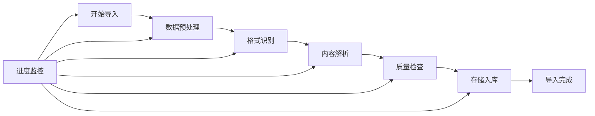

# 批量数据导入

高效批量导入各种格式的数据到 FastGPT 知识库系统。

## 功能概述

批量数据导入功能支持一次性导入大量文档和数据，自动处理格式转换、内容解析和质量检查，大幅提升知识库建设效率。

## 支持的数据格式

### 📄 文档格式

#### 文本文档
- **PDF 文档**：
  - 支持文字PDF和扫描PDF
  - 自动提取文本、图片和表格
  - 保留文档结构和格式
  - 处理多列布局和复杂排版

- **Microsoft Office**：
  - Word文档（.doc, .docx）
  - Excel表格（.xls, .xlsx）
  - PowerPoint演示文稿（.ppt, .pptx）

- **纯文本格式**：
  - TXT文件
  - RTF富文本格式
  - Markdown文档（.md）

#### 结构化数据
- **JSON 格式**：
  ```json
  {
    "documents": [
      {
        "title": "文档标题",
        "content": "文档内容",
        "category": "分类",
        "tags": ["标签1", "标签2"]
      }
    ]
  }
  ```

- **CSV 格式**：
  ```csv
  标题,内容,分类,标签
  "API使用指南","详细的API使用说明...","技术文档","API,教程"
  ```

- **XML 格式**：
  ```xml
  <documents>
    <document>
      <title>文档标题</title>
      <content>文档内容</content>
      <category>分类</category>
    </document>
  </documents>
  ```

### 🌐 网页格式

#### Web 内容
- **HTML 文件**：
  - 自动提取正文内容
  - 过滤导航和广告
  - 保留文本结构

- **网页快照**：
  - MHTML格式
  - 完整页面内容
  - 包含样式和图片

### 🗄️ 数据库导入

#### 关系型数据库
- **MySQL**
- **PostgreSQL**
- **SQL Server**
- **Oracle**

#### NoSQL 数据库
- **MongoDB**
- **Elasticsearch**
- **Redis**

#### 连接配置示例
```json
{
  "type": "mysql",
  "host": "localhost",
  "port": 3306,
  "database": "knowledge_base",
  "username": "user",
  "password": "password",
  "table": "documents",
  "fields": {
    "title": "title",
    "content": "content",
    "category": "category"
  }
}
```

## 导入流程

### 1. 数据准备

#### 文件组织
```
导入数据/
├── 技术文档/
│   ├── API文档.pdf
│   ├── 开发指南.docx
│   └── 常见问题.md
├── 产品资料/
│   ├── 产品介绍.pptx
│   ├── 功能说明.pdf
│   └── 用户手册.docx
└── 配置文件/
    ├── import_config.json
    └── field_mapping.csv
```

#### 配置文件设置
```json
{
  "import_settings": {
    "batch_size": 100,
    "parallel_workers": 5,
    "skip_duplicates": true,
    "auto_categorize": true
  },
  "content_processing": {
    "extract_images": true,
    "preserve_formatting": true,
    "auto_segment": true,
    "min_content_length": 50
  },
  "quality_check": {
    "enable_validation": true,
    "check_encoding": true,
    "remove_duplicates": true
  }
}
```

### 2. 执行导入

#### 2.1 选择导入方式

**文件上传导入**
1. 进入批量处理页面
2. 选择"批量数据导入"
3. 上传文件或文件夹
4. 配置导入参数
5. 开始导入任务

**URL导入**
1. 提供数据源URL
2. 配置访问认证
3. 设置抓取规则
4. 执行远程导入

**数据库导入**
1. 配置数据库连接
2. 设置查询语句
3. 映射字段关系
4. 执行批量导入

#### 2.2 导入监控



**监控界面显示：**
- 总任务数量和进度
- 当前处理文件名
- 成功/失败统计
- 错误日志详情
- 预计完成时间

### 3. 结果验证

#### 3.1 导入报告
```
导入任务报告
==============
任务ID: BATCH_20241201_001
开始时间: 2024-12-01 10:00:00
结束时间: 2024-12-01 10:45:30
总耗时: 45分30秒

统计信息:
- 总文件数: 1,500
- 成功导入: 1,485
- 导入失败: 15
- 跳过重复: 0

详细结果:
- PDF文档: 800个 (成功: 795, 失败: 5)
- Word文档: 500个 (成功: 495, 失败: 5)
- Excel文档: 200个 (成功: 195, 失败: 5)
```

#### 3.2 质量检查
- **内容完整性**：检查导入内容是否完整
- **格式正确性**：验证格式转换是否正确
- **重复检测**：识别重复或相似内容
- **分类准确性**：验证自动分类结果

## 高级功能

### 1. 智能预处理

#### 内容清洗
```python
def clean_content(text):
    """智能内容清洗"""
    # 移除多余空白
    text = re.sub(r'\s+', ' ', text)
    
    # 修复编码问题
    text = fix_encoding(text)
    
    # 标准化格式
    text = normalize_format(text)
    
    # 移除敏感信息
    text = remove_sensitive_data(text)
    
    return text
```

#### 自动分段
```python
def auto_segment(content, max_length=1000):
    """智能内容分段"""
    segments = []
    
    # 按章节分割
    chapters = split_by_headers(content)
    
    for chapter in chapters:
        # 按段落分割
        paragraphs = split_by_paragraphs(chapter)
        
        # 合并短段落
        merged = merge_short_paragraphs(paragraphs, max_length)
        segments.extend(merged)
    
    return segments
```

### 2. 批量转换

#### 格式标准化
- **文档格式统一**：转换为统一的内部格式
- **编码标准化**：统一字符编码（UTF-8）
- **结构规范化**：标准化文档结构和层级

#### 内容增强
```python
def enhance_content(document):
    """内容增强处理"""
    # 自动生成摘要
    document['summary'] = generate_summary(document['content'])
    
    # 提取关键词
    document['keywords'] = extract_keywords(document['content'])
    
    # 自动分类
    document['category'] = auto_categorize(document['content'])
    
    # 生成标签
    document['tags'] = generate_tags(document['content'])
    
    return document
```

### 3. 增量更新

#### 变更检测
```python
def detect_changes(new_content, existing_content):
    """检测内容变更"""
    changes = {
        'added': [],
        'modified': [],
        'deleted': []
    }
    
    # 计算内容哈希
    new_hash = calculate_hash(new_content)
    existing_hash = calculate_hash(existing_content)
    
    if new_hash != existing_hash:
        changes['modified'].append({
            'content_id': content_id,
            'change_type': 'content_update',
            'timestamp': datetime.now()
        })
    
    return changes
```

#### 智能合并
- **版本控制**：保留历史版本
- **冲突解决**：智能处理内容冲突
- **增量同步**：只更新变更部分

## 错误处理

### 常见错误类型

#### 1. 格式错误
```python
class FormatError(Exception):
    """格式错误异常"""
    def __init__(self, file_path, error_detail):
        self.file_path = file_path
        self.error_detail = error_detail
        super().__init__(f"格式错误 {file_path}: {error_detail}")

# 错误处理示例
try:
    content = parse_document(file_path)
except FormatError as e:
    log_error(e)
    # 尝试其他解析方式
    content = fallback_parse(file_path)
```

#### 2. 编码错误
```python
def handle_encoding_error(file_path):
    """处理编码错误"""
    encodings = ['utf-8', 'gbk', 'gb2312', 'big5']
    
    for encoding in encodings:
        try:
            with open(file_path, 'r', encoding=encoding) as f:
                return f.read()
        except UnicodeDecodeError:
            continue
    
    raise EncodingError(f"无法识别文件编码: {file_path}")
```

#### 3. 大文件处理
```python
def process_large_file(file_path, chunk_size=10*1024*1024):
    """处理大文件"""
    file_size = os.path.getsize(file_path)
    
    if file_size > 100*1024*1024:  # 100MB
        # 分块处理
        return process_in_chunks(file_path, chunk_size)
    else:
        # 直接处理
        return process_directly(file_path)
```

### 错误恢复机制

#### 断点续传
```python
def resume_import(task_id):
    """恢复中断的导入任务"""
    # 加载任务状态
    task_state = load_task_state(task_id)
    
    # 获取已处理文件列表
    processed_files = task_state['processed_files']
    
    # 继续处理剩余文件
    remaining_files = get_remaining_files(task_state['file_list'], processed_files)
    
    # 恢复处理
    continue_processing(remaining_files, task_state)
```

#### 重试机制
```python
def import_with_retry(file_path, max_retries=3):
    """带重试的导入处理"""
    for attempt in range(max_retries):
        try:
            return import_file(file_path)
        except RetryableError as e:
            if attempt < max_retries - 1:
                wait_time = 2 ** attempt  # 指数退避
                time.sleep(wait_time)
                continue
            else:
                raise e
```

## 性能优化

### 并行处理策略

#### 多线程处理
```python
from concurrent.futures import ThreadPoolExecutor
import queue

def parallel_import(file_list, max_workers=5):
    """并行导入文件"""
    results = []
    
    with ThreadPoolExecutor(max_workers=max_workers) as executor:
        # 提交任务
        futures = {
            executor.submit(import_file, file_path): file_path 
            for file_path in file_list
        }
        
        # 收集结果
        for future in concurrent.futures.as_completed(futures):
            file_path = futures[future]
            try:
                result = future.result()
                results.append(result)
            except Exception as e:
                log_error(f"处理文件失败 {file_path}: {e}")
    
    return results
```

#### 内存管理
```python
def memory_efficient_import(large_file_list):
    """内存友好的批量导入"""
    batch_size = calculate_optimal_batch_size()
    
    for i in range(0, len(large_file_list), batch_size):
        batch = large_file_list[i:i + batch_size]
        
        # 处理批次
        process_batch(batch)
        
        # 清理内存
        gc.collect()
        
        # 监控内存使用
        if get_memory_usage() > 80:  # 80%
            batch_size = max(1, batch_size // 2)
```

### 缓存优化

#### 解析结果缓存
```python
import functools

@functools.lru_cache(maxsize=1000)
def parse_document_cached(file_path, file_hash):
    """缓存文档解析结果"""
    return parse_document(file_path)

def import_with_cache(file_path):
    """使用缓存的导入"""
    file_hash = calculate_file_hash(file_path)
    return parse_document_cached(file_path, file_hash)
```

## 质量保证

### 数据验证

#### 内容质量检查
```python
def validate_content_quality(content):
    """内容质量验证"""
    issues = []
    
    # 检查内容长度
    if len(content.strip()) < 10:
        issues.append("内容过短")
    
    # 检查字符编码
    if not is_valid_encoding(content):
        issues.append("编码问题")
    
    # 检查内容结构
    if not has_valid_structure(content):
        issues.append("结构不规范")
    
    # 检查重复内容
    if is_duplicate_content(content):
        issues.append("重复内容")
    
    return issues
```

#### 自动修复
```python
def auto_fix_content(content, issues):
    """自动修复内容问题"""
    for issue in issues:
        if issue == "编码问题":
            content = fix_encoding(content)
        elif issue == "结构不规范":
            content = normalize_structure(content)
        elif issue == "格式错误":
            content = fix_formatting(content)
    
    return content
```

### 导入后验证

#### 完整性检查
```python
def verify_import_completeness(original_files, imported_records):
    """验证导入完整性"""
    verification_report = {
        'total_files': len(original_files),
        'imported_count': len(imported_records),
        'missing_files': [],
        'corrupt_imports': []
    }
    
    # 检查文件对应关系
    for file_path in original_files:
        if not find_imported_record(file_path, imported_records):
            verification_report['missing_files'].append(file_path)
    
    # 检查导入质量
    for record in imported_records:
        if not validate_record_integrity(record):
            verification_report['corrupt_imports'].append(record)
    
    return verification_report
```

## 最佳实践

### 1. 导入前准备
- **数据整理**：统一文件格式和命名规范
- **质量预检**：提前检查数据质量问题
- **备份原始数据**：保留原始数据副本
- **测试小批量**：先用小数据集测试流程

### 2. 导入配置优化
- **合理设置批次大小**：根据系统性能调整
- **选择适当并发数**：避免资源过载
- **启用错误恢复**：确保任务可恢复
- **配置监控告警**：及时发现问题

### 3. 导入后维护
- **定期质量检查**：检查导入数据质量
- **更新索引**：重建搜索索引
- **性能监控**：监控系统性能变化
- **用户反馈收集**：收集使用反馈

---

*通过批量数据导入功能，可以快速构建大规模知识库，提升数据处理效率。*
