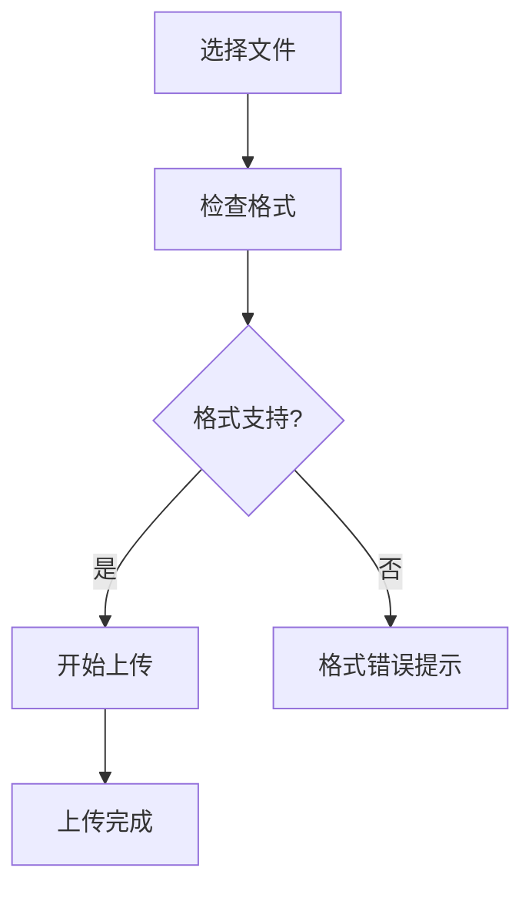
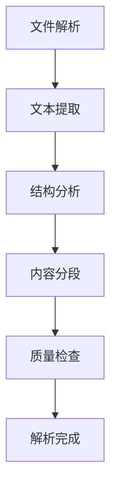
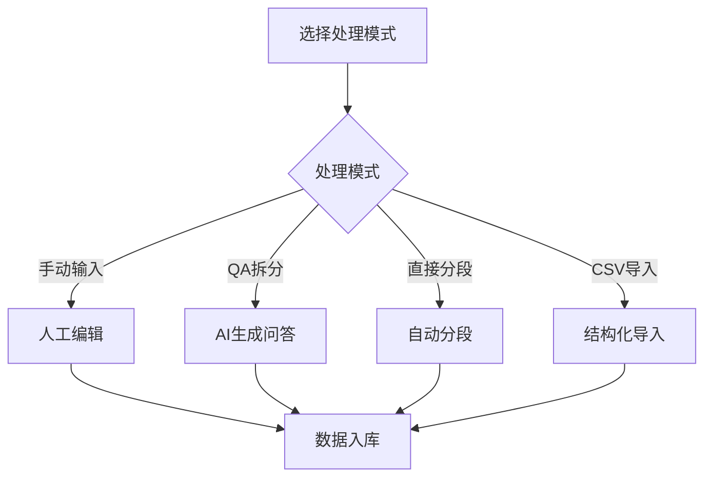

# 文件输入功能介绍

FastGPT 提供了强大的文件输入功能，支持多种文档格式和数据处理方式。本文将详细介绍文件输入功能的使用方法和最佳实践。

## 支持的文件格式

FastGPT 支持多种常见的文档格式：

### 文档类型
- **Word 文档**：.doc、.docx
- **PDF 文件**：包括扫描件和可编辑 PDF
- **文本文件**：.txt、.md
- **表格文件**：.xlsx、.xls、.csv
- **演示文稿**：.ppt、.pptx
- **网页文件**：.html

### 特殊支持
- **图片文件**：.jpg、.png、.gif（OCR 识别）
- **压缩包**：.zip（批量处理）
- **代码文件**：常见编程语言源码

## 文件上传方式

### 1. 拖拽上传
最简单的上传方式，直接将文件拖拽到上传区域即可。


### 2. 点击选择
点击上传按钮，从文件浏览器中选择要上传的文件。


### 3. 批量上传
支持同时选择多个文件进行批量上传处理。


## 数据处理模式

### 1. 手动输入
最精准的数据处理方式，适用于：
- 重要的问答对
- 精确的知识条目
- 核心业务信息

**特点：**
- 准确度最高
- 需要人工投入
- 适合小量数据

### 2. QA 拆分
AI 自动生成问答对，适用于：
- 结构化文档
- 教程和手册
- FAQ 文档

**特点：**
- 自动化程度高
- 生成质量较好
- 可后期调整


### 3. 直接分段
按段落直接处理文档，适用于：
- 长篇文章
- 技术文档
- 知识库文档

**特点：**
- 保留原文结构
- 处理速度快
- 适合大量数据


### 4. CSV 导入
批量导入结构化数据，适用于：
- 数据库导出
- 表格数据
- 批量问答对

**CSV 格式要求：**
```csv
问题,答案,来源
如何使用FastGPT?,FastGPT是一个基于LLM的知识库问答系统,官方文档
什么是知识库?,知识库是存储和管理知识的系统,产品手册
```

## 高级功能

### 1. OCR 识别
对于图片和扫描件，FastGPT 提供 OCR 识别功能：

**支持场景：**
- 扫描的 PDF 文档
- 图片中的文字内容
- 手写文档识别

**识别准确率：**
- 印刷体文字：>95%
- 手写文字：>85%
- 复杂版面：>90%

### 2. 表格解析
智能解析表格结构，保留数据关系：

**解析能力：**
- 表头识别
- 数据类型判断
- 关系保持


### 3. 图片标注
自动识别和标注图片内容：

**功能特点：**
- 对象识别
- 场景描述
- 文字提取

### 4. 多语言支持
支持多种语言的文档处理：

**支持语言：**
- 中文（简体/繁体）
- 英文
- 日文
- 韩文
- 其他主流语言

## 文件处理流程

### 1. 文件上传


### 2. 内容解析


### 3. 数据处理


## 质量优化

### 1. 文档预处理
上传前的文档优化建议：

**文档清理：**
- 删除无关内容
- 修正格式错误
- 统一样式规范

**结构优化：**
- 清晰的标题层级
- 合理的段落分割
- 准确的标点符号

### 2. 处理参数调整
根据文档特点调整处理参数：

**分段参数：**
- 段落长度：500-1500 字符
- 重叠长度：50-200 字符
- 最小段落：100 字符

**QA 生成参数：**
- 问题数量：每段 1-3 个问题
- 问题类型：事实性、操作性、概念性
- 答案长度：100-500 字符

### 3. 后期优化
处理完成后的质量提升：

**内容审核：**
- 检查问答准确性
- 修正分段错误
- 补充缺失信息

**结构调整：**
- 合并相似内容
- 删除重复信息
- 优化问题表述

## 常见问题

### 1. 上传失败
**可能原因：**
- 文件格式不支持
- 文件大小超限
- 网络连接问题

**解决方案：**
- 检查文件格式
- 压缩文件大小
- 重新上传

### 2. 识别错误
**可能原因：**
- 图片质量较差
- 文档格式复杂
- 语言识别错误

**解决方案：**
- 提高图片清晰度
- 简化文档格式
- 手动修正错误

### 3. 处理缓慢
**可能原因：**
- 文件过大
- 服务器负载高
- 处理模式复杂

**解决方案：**
- 分批处理
- 错峰上传
- 选择简单模式

## 最佳实践

:::tip 上传建议
- 文档格式要规范统一
- 内容要准确完整
- 结构要清晰明确
- 定期更新和维护
:::

:::warning 注意事项
- 确保文档版权合规
- 避免敏感信息泄露
- 定期备份重要数据
- 监控处理质量
:::

## 下一步

完成文件上传后，您可以：
- [AI 参数配置](./AI参数配置.md) - 优化模型参数
- [快速上手](./快速上手.md) - 创建第一个应用
- [对话问题引导](./对话问题引导.md) - 提升交互体验
