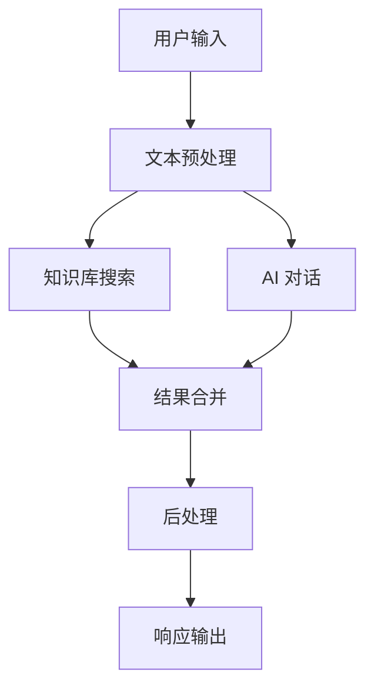

# 工作台介绍

FastGPT 工作台是一个可视化的低代码工作流编排平台，让您可以像搭积木一样轻松构建复杂的 AI 应用。

## 什么是工作台

工作台是 FastGPT 的核心功能之一，它提供了：

- **可视化编排**：通过拖拽的方式构建工作流
- **丰富的模块**：内置多种功能模块，满足不同需求
- **灵活的连接**：模块间可以灵活连接，实现复杂逻辑
- **实时调试**：支持工作流的实时测试和调试

## 主要特性

### 1. 可视化设计

采用流程图的方式展示应用逻辑，直观易懂：

- 拖拽式操作，无需编程基础
- 实时预览应用效果
- 支持多种布局和样式

### 2. 丰富的功能模块

提供多种预置模块：

- **AI 对话**：集成各种大语言模型
- **知识库搜索**：连接知识库进行智能检索
- **HTTP 请求**：调用外部 API 接口
- **代码执行**：执行自定义代码逻辑
- **条件判断**：实现分支逻辑控制
- **文本处理**：文本格式化和转换
- **数据转换**：数据格式转换和处理

### 3. 流程控制

支持复杂的流程控制：

- **条件分支**：根据条件执行不同路径
- **循环处理**：批量处理数据
- **异常处理**：错误处理和容错机制
- **并行执行**：同时执行多个任务

### 4. 数据传递

模块间可以灵活传递数据：

- **变量定义**：支持全局和局部变量
- **数据映射**：字段映射和数据转换
- **类型检查**：确保数据类型匹配
- **格式验证**：验证数据格式正确性

## 工作流架构

## 使用场景

### 1. 智能客服

构建多轮对话的智能客服系统：

- 意图识别
- 知识库查询
- 人工转接
- 满意度评价

### 2. 文档分析

自动分析和处理文档：

- 文档解析
- 内容提取
- 格式转换
- 结果输出

### 3. 数据处理

批量处理和分析数据：

- 数据清洗
- 格式转换
- 统计分析
- 报告生成

### 4. API 集成

集成多个外部服务：

- 数据获取
- 逻辑处理
- 结果整合
- 通知发送

## 开始使用

1. **创建应用**：在应用列表中点击"新建应用"
2. **选择模板**：选择合适的工作流模板
3. **编辑工作流**：拖拽模块构建工作流
4. **配置参数**：设置各模块的参数
5. **测试调试**：使用调试功能验证逻辑
6. **发布应用**：保存并发布应用

## 最佳实践

### 1. 模块化设计

- 将复杂逻辑拆分为多个简单模块
- 每个模块职责单一，便于维护
- 合理使用子工作流功能

### 2. 错误处理

- 为关键节点添加错误处理
- 设置合理的超时时间
- 提供友好的错误提示

### 3. 性能优化

- 避免不必要的API调用
- 合理使用缓存机制
- 优化数据传递路径

### 4. 调试技巧

- 使用调试模式逐步验证
- 检查数据传递是否正确
- 关注日志输出信息

## 常见问题

### Q: 工作流执行失败怎么办？

A: 检查以下几个方面：
- 模块配置是否正确
- 数据传递是否匹配
- API 接口是否可用
- 权限设置是否正确

### Q: 如何优化工作流性能？

A: 可以从以下方面优化：
- 减少不必要的模块
- 优化API调用次数
- 使用并行处理
- 合理设置超时时间

### Q: 支持哪些数据格式？

A: 支持多种数据格式：
- JSON
- XML
- CSV
- 文本格式
- 二进制数据

## 相关文档

- [模块详细说明](./模块详细说明.md)
- [工作流最佳实践](./工作流最佳实践.md)
- [调试和测试](./调试和测试.md)
- [性能优化指南](./性能优化指南.md)

