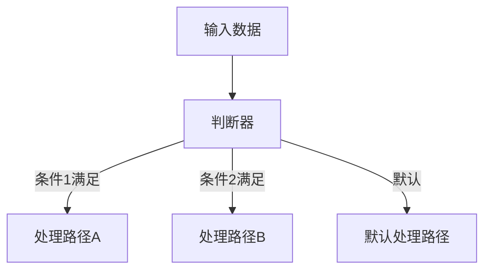
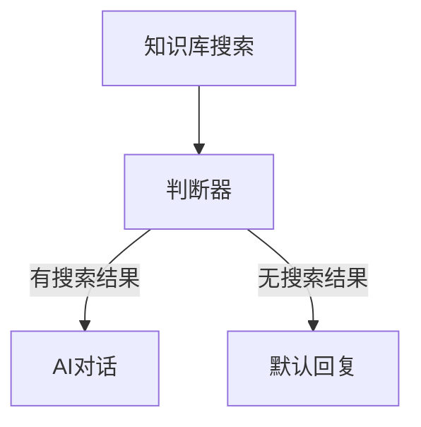
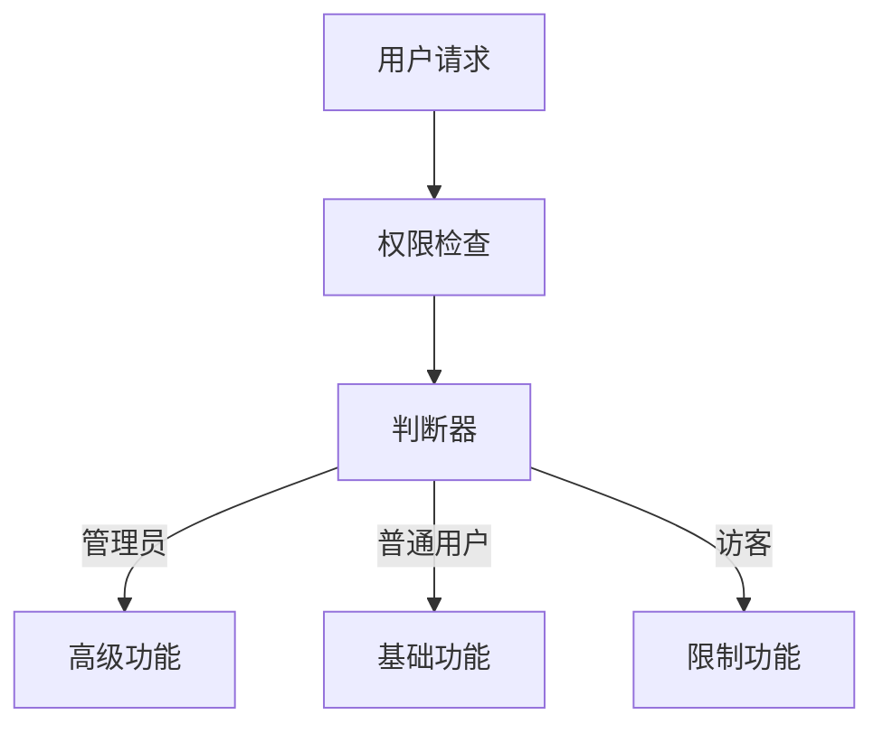
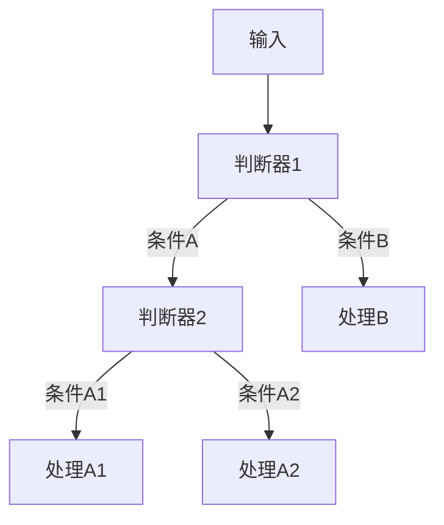

# 判断器

## 特点

- 可重复添加
- 有外部输入
- 触发执行

<!-- 判断器模块界面图 -->

## 功能

对任意变量进行`IF`判断，若满足条件则执行`IF`分支，不满足条件执行`ELSE`分支。

上述例子中若「知识库引用」变量的长度等于0则执行`IF`分支，否则执行`ELSE`分支。

支持增加更多的判断条件和分支，同编程语言中的`IF`语句逻辑相同。

## 作用

适用场景有：让大模型做判断后输出固定内容，根据大模型回复内容判断是否触发后续模块。

## 使用场景

### 条件分支

根据变量值执行不同的处理逻辑：



### 错误处理

根据前置节点的执行结果决定是否继续：



### 用户权限控制

根据用户权限执行不同操作：



## 判断条件类型

### 数值比较

- **等于**：变量值等于目标值
- **不等于**：变量值不等于目标值  
- **大于**：变量值大于目标值
- **小于**：变量值小于目标值
- **大于等于**：变量值大于等于目标值
- **小于等于**：变量值小于等于目标值

### 字符串比较

- **包含**：字符串包含指定内容
- **不包含**：字符串不包含指定内容
- **开始于**：字符串以指定内容开始
- **结束于**：字符串以指定内容结束
- **正则匹配**：使用正则表达式匹配

### 数组/列表判断

- **长度判断**：数组长度的比较
- **包含元素**：数组是否包含指定元素
- **为空判断**：数组是否为空

### 布尔判断

- **为真**：变量值为 true
- **为假**：变量值为 false

## 配置示例

### 知识库搜索结果判断

**判断条件：**
```
变量：{{知识库引用}}
条件：数组长度 > 0
```

**分支处理：**
- **IF分支**：有搜索结果 → 继续AI对话
- **ELSE分支**：无搜索结果 → 返回默认回复

### 用户类型判断

**判断条件：**
```
变量：{{用户类型}}
条件：等于 "VIP"
```

**分支处理：**
- **IF分支**：VIP用户 → 专属服务流程
- **ELSE分支**：普通用户 → 标准服务流程

### 内容长度判断

**判断条件：**
```
变量：{{用户输入}}
条件：字符串长度 > 100
```

**分支处理：**
- **IF分支**：长文本 → 使用摘要处理
- **ELSE分支**：短文本 → 直接处理

## 复杂判断

### 多条件判断

支持 AND 和 OR 逻辑：

```
条件1：用户类型 等于 "VIP"
并且
条件2：积分 大于等于 1000
```

### 嵌套判断

通过多个判断器实现复杂逻辑：



### 范围判断

判断数值是否在指定范围内：

```
条件1：年龄 >= 18
AND
条件2：年龄 <= 65
```

## 最佳实践

### 判断条件设计

1. **条件明确**：确保判断条件清晰明确，避免歧义
2. **边界处理**：考虑边界值和异常情况
3. **性能考虑**：避免过于复杂的判断逻辑
4. **可维护性**：保持判断逻辑的可读性和可维护性

### 分支设计

1. **分支完整**：确保所有可能的情况都有对应的分支
2. **默认分支**：设置合理的默认处理分支
3. **错误处理**：考虑判断失败时的处理方式
4. **分支平衡**：避免分支过多导致流程复杂

### 调试技巧

1. **日志记录**：记录判断结果和分支执行情况
2. **测试用例**：准备充分的测试用例验证判断逻辑
3. **监控告警**：监控异常分支的执行频率
4. **逐步调试**：复杂判断可以分解为多个简单判断

## 高级应用

### 动态阈值

根据历史数据动态调整判断阈值：

```javascript
// 示例：根据历史平均值动态调整阈值
const threshold = 历史平均值 * 1.2; // 阈值为历史平均值的120%
判断条件 = `当前值 > ${threshold}`;
```

### 时间窗口判断

在特定时间窗口内应用不同的判断逻辑：

```javascript
// 示例：工作时间和非工作时间不同的处理逻辑
const now = new Date();
const hour = now.getHours();

if (hour >= 9 && hour <= 18) {
  // 工作时间逻辑
  条件 = "响应时间 <= 5分钟";
} else {
  // 非工作时间逻辑
  条件 = "响应时间 <= 30分钟";
}
```

### 概率判断

基于概率的随机分支：

```javascript
// 示例：A/B测试的随机分组
const random = Math.random();
if (random < 0.5) {
  执行("版本A流程");
} else {
  执行("版本B流程");
}
```

## 注意事项

1. **数据类型**：确保比较的数据类型一致
2. **空值处理**：考虑变量为空或未定义的情况
3. **性能影响**：复杂判断可能影响流程执行速度
4. **逻辑完整性**：确保判断逻辑覆盖所有可能情况
5. **可读性**：保持判断条件的可读性，便于后续维护
