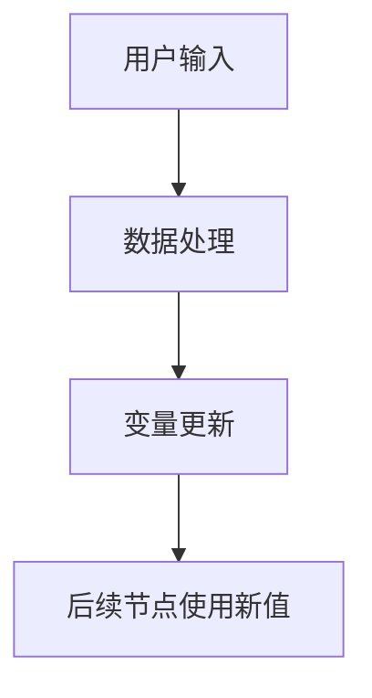
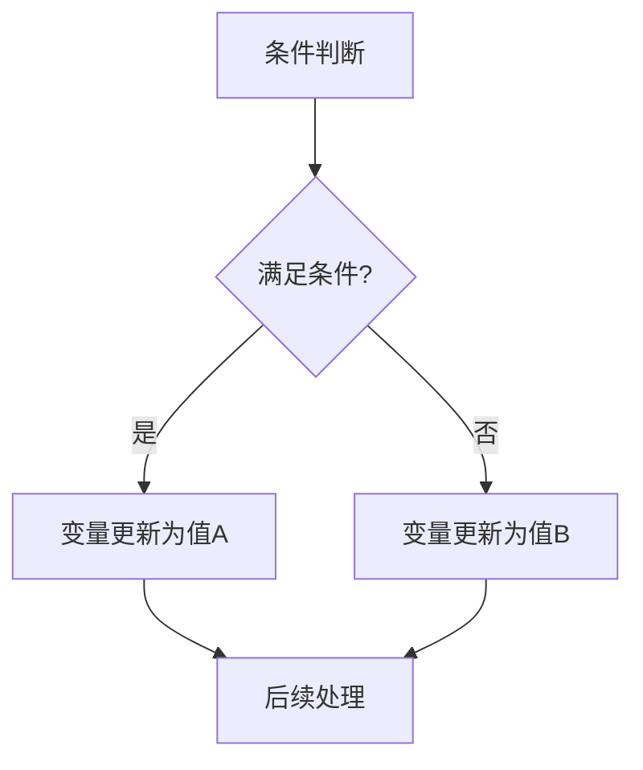
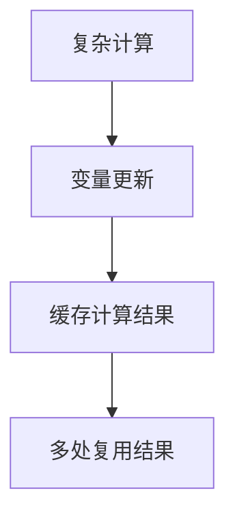
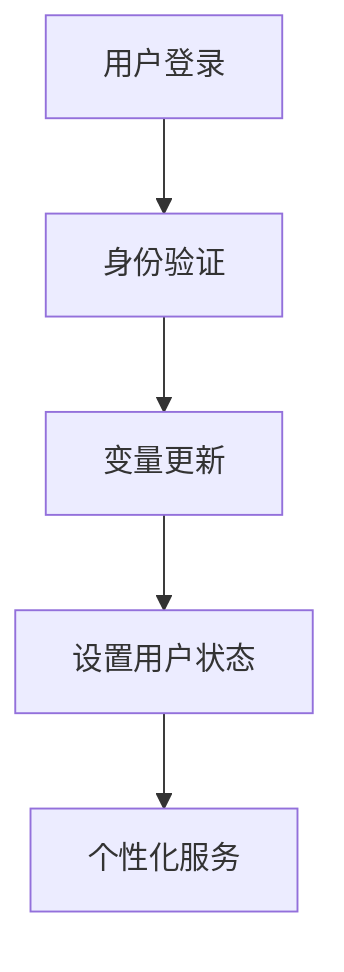
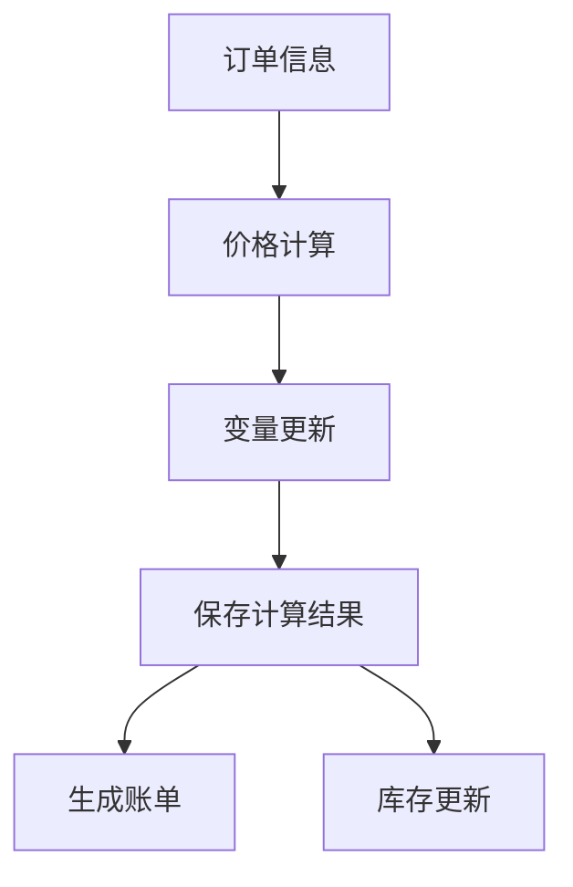
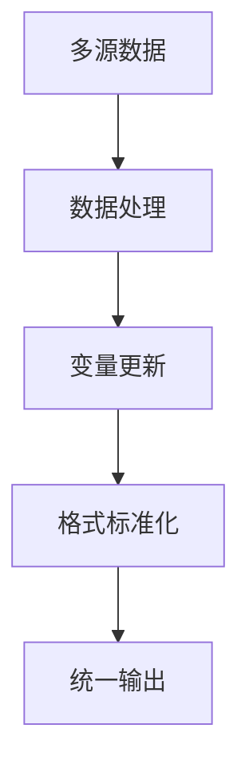
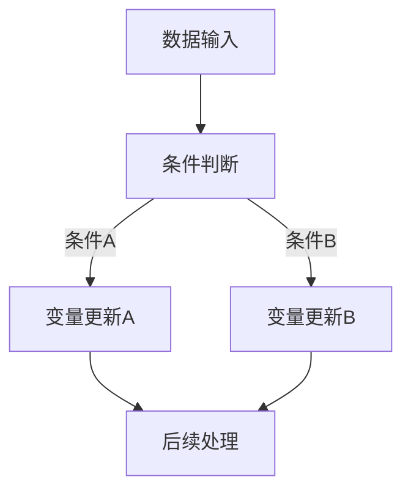

# 变量更新

## 特点 

- 可重复添加
- 有外部输入
- 触发执行
- 手动配置

<!-- 变量更新模块界面图 -->

## 功能 

变量更新模块主要有两个功能：

### 1. 更新指定节点的输出值

<!-- 节点输出更新图 -->

<!-- 节点输出配置图 -->

可以修改工作流中任意节点的输出值，影响后续节点对该输出的引用。

### 2. 更新全局变量

<!-- 全局变量更新图 -->

<!-- 全局变量配置图 -->

可以修改工作流的全局变量值，实现变量的动态赋值。

## 作用

最基础的使用场景为：

- 给一个「自定义变量」类型的全局变量赋值，从而实现全局变量无需用户输入
- 更新「变量更新」节点前的工作流节点输出，在后续使用中，使用的节点输出值为新的输出

## 使用场景

### 动态变量赋值

在工作流执行过程中动态设置变量值：



### 条件变量设置

根据条件设置不同的变量值：



### 计算结果缓存

将计算结果保存为变量供后续使用：



## 更新类型

### 节点输出更新

**使用场景：**
- 修正节点输出的格式
- 对输出内容进行后处理
- 统一不同节点的输出格式
- 添加额外的计算结果

**示例：**
```javascript
// 原始AI对话输出
原始输出 = "用户问题的答案";

// 通过变量更新添加时间戳
更新后输出 = {
  "answer": "用户问题的答案",
  "timestamp": "2024-01-01 12:00:00",
  "confidence": 0.95
};
```

### 全局变量更新

**使用场景：**
- 设置用户会话状态
- 保存计算的中间结果
- 实现跨节点的数据传递
- 动态配置工作流参数

**示例：**
```javascript
// 更新用户状态
全局变量.用户状态 = "已认证";
全局变量.登录时间 = new Date();
全局变量.权限级别 = "VIP";

// 更新计算结果
全局变量.总金额 = 商品价格 * 数量 * 折扣;
全局变量.配送费 = 总金额 > 100 ? 0 : 10;
```

## 配置说明

### 更新节点输出

1. **选择目标节点**：选择要更新输出的节点
2. **选择输出字段**：选择要更新的具体输出字段
3. **设置新值**：
   - 直接赋值：输入固定的新值
   - 变量引用：使用其他变量的值
   - 表达式计算：使用计算表达式

### 更新全局变量

1. **选择变量**：选择要更新的全局变量
2. **变量类型**：
   - 自定义变量：用户自定义的变量
   - 系统变量：系统内置的变量
3. **新值设置**：
   - 文本值：字符串类型的值
   - 数值：数字类型的值
   - 布尔值：true/false
   - 对象：JSON格式的复杂数据

## 实际应用示例

### 用户状态管理



**配置：**
```
全局变量更新：
- 用户ID = {{验证结果.userId}}
- 用户角色 = {{验证结果.role}}
- 登录状态 = true
- 会话开始时间 = {{current_time}}
```

### 计算过程优化



**配置：**
```
节点输出更新：
目标节点：价格计算
输出字段：计算结果
新值：{
  "subtotal": {{商品总价}},
  "tax": {{税费}},
  "shipping": {{运费}},
  "discount": {{折扣金额}},
  "total": {{最终总价}}
}
```

### 数据格式标准化



**配置：**
```
节点输出更新：
原始输出：不规范的数据格式
标准化输出：{
  "id": {{数据ID}},
  "name": {{规范化名称}},
  "value": {{标准化数值}},
  "status": {{状态映射}},
  "timestamp": {{格式化时间}}
}
```

## 高级技巧

### 条件变量更新

结合判断器实现条件性的变量更新：



### 批量变量更新

一次性更新多个相关变量：

```javascript
// 示例：批量更新用户信息
{
  "用户基本信息": {
    "姓名": {{用户姓名}},
    "邮箱": {{用户邮箱}},
    "电话": {{用户电话}}
  },
  "用户状态": {
    "在线状态": true,
    "最后活跃时间": {{current_time}},
    "权限级别": {{用户权限}}
  },
  "业务数据": {
    "积分余额": {{计算后积分}},
    "会员等级": {{更新后等级}},
    "优惠券数量": {{可用优惠券}}
  }
}
```

### 变量版本控制

保留变量的历史版本：

```javascript
// 示例：保留变量更新历史
全局变量.用户状态历史 = [
  ...全局变量.用户状态历史,
  {
    "状态": {{新状态}},
    "更新时间": {{current_time}},
    "更新原因": {{更新原因}},
    "操作人": {{操作人ID}}
  }
];
```

## 最佳实践

### 变量命名

1. **语义明确**：使用有意义的变量名
2. **命名规范**：保持一致的命名风格
3. **避免冲突**：避免与系统变量重名
4. **分组管理**：相关变量使用统一前缀

### 更新策略

1. **原子操作**：确保变量更新的原子性
2. **类型一致**：保持变量类型的一致性
3. **默认值**：为变量设置合理的默认值
4. **边界检查**：对变量值进行边界检查

### 性能优化

1. **减少更新频率**：避免频繁的变量更新
2. **批量更新**：合并相关的变量更新操作
3. **缓存策略**：合理使用变量缓存
4. **清理机制**：定期清理不需要的变量

## 注意事项

1. **变量作用域**：理解全局变量和局部变量的作用域
2. **更新顺序**：注意变量更新的先后顺序
3. **循环依赖**：避免变量之间的循环依赖
4. **类型安全**：确保变量类型的正确性
5. **并发安全**：考虑并发访问时的变量安全
6. **调试困难**：过多的变量更新可能增加调试难度
