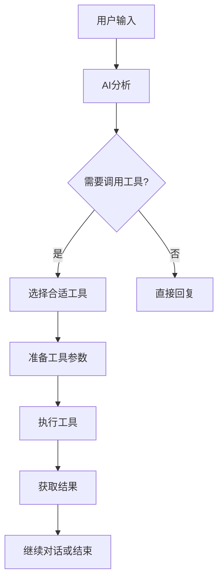
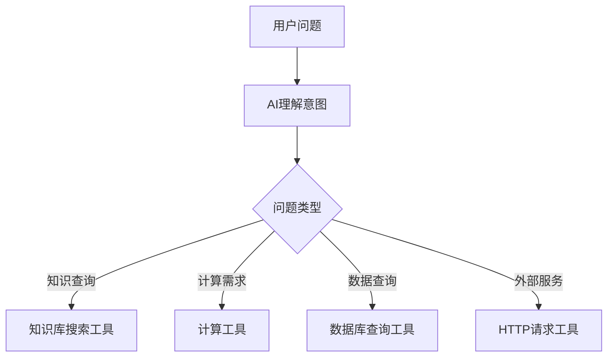
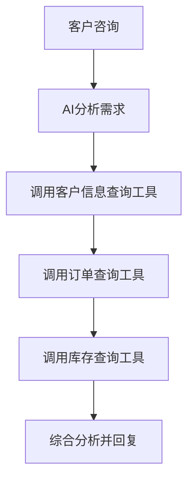
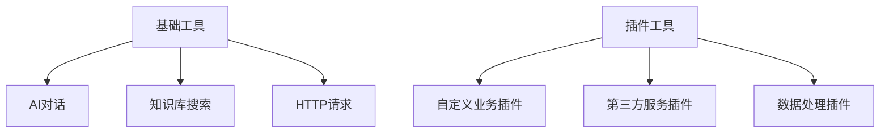
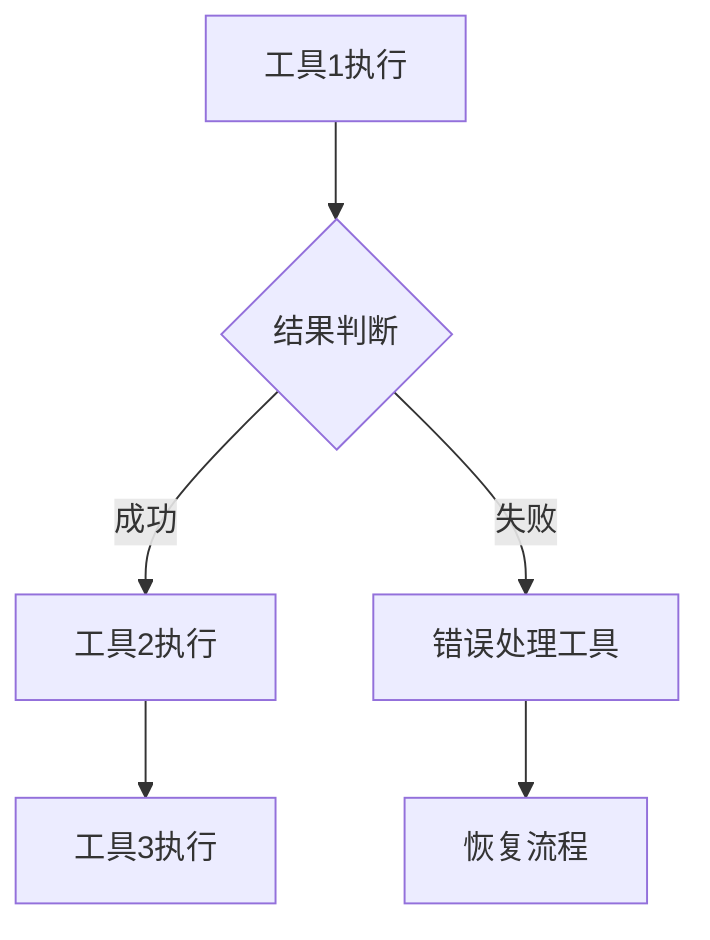
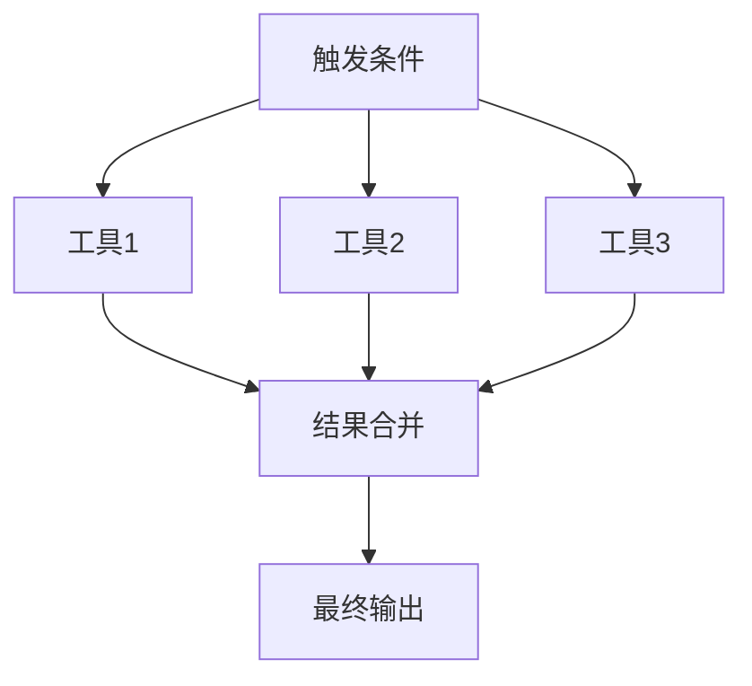

# 工具调用&终止

<!-- 工具调用模块界面图 -->

## 什么是工具

工具可以是一个系统模块，例如：AI对话、知识库搜索、HTTP模块等。也可以是一个插件。

工具调用可以让 LLM 更动态的决策流程，而不都是固定的流程。（当然，缺点就是费tokens）

## 工具的组成

1. **工具介绍**：通常是模块的介绍或插件的介绍，这个介绍会告诉LLM，这个工具的作用是什么
2. **工具参数**：对于系统模块来说，工具参数已经是固定的，无需额外配置。对于插件来说，工具参数是一个可配置项

## 工具是如何运行的

要了解工具如何运行的，首先需要知道它的运行条件：

1. **需要工具的介绍**（或者叫描述）：这个介绍会告诉LLM，这个工具的作用是什么，LLM会根据上下文语义，决定是否需要调用这个工具
2. **工具的参数**：有些工具调用时，可能需要一些特殊的参数。参数中有2个关键的值：`参数介绍`和`是否必须`

### 运行流程



## 使用场景

### 动态工具选择

根据用户需求自动选择合适的工具：



### 复杂业务流程

通过工具调用实现复杂的业务逻辑：



### 插件扩展

通过插件扩展工具调用的能力：



## 配置说明

### 工具配置

<!-- 工具配置界面图 -->

<!-- 工具连接示例图 -->

高级编排中，拖动工具调用的连接点，可用的工具头部会出现一个菱形，可以将它与工具调用模块底部的菱形相连接。

被连接的工具，会自动分离工具输入与普通的输入，并且可以编辑`介绍`，可以通过调整介绍，使得该工具调用时机更加精确。

### 工具介绍编写

工具介绍是 LLM 判断是否调用该工具的重要依据，编写时要注意：

1. **明确工具作用**：清楚描述工具的主要功能
2. **使用场景**：说明什么情况下应该使用这个工具
3. **参数说明**：简要说明需要的参数类型
4. **预期结果**：描述工具调用后的预期输出

**示例：知识库搜索工具介绍**
```
这是一个知识库搜索工具，用于从企业知识库中检索相关信息。
当用户询问产品功能、技术文档、操作指南等问题时，应该调用此工具。
需要提供搜索关键词作为参数。
返回相关的文档片段和参考信息。
```

**示例：订单查询工具介绍**
```
这是订单查询工具，用于查询用户的订单信息。
当用户询问订单状态、物流信息、订单详情时调用。
需要提供订单号或用户ID作为查询参数。
返回订单的详细信息包括状态、商品、金额等。
```

## 工具参数配置

### 参数类型

- **字符串参数**：文本输入，如搜索关键词、用户名等
- **数字参数**：数值输入，如数量、金额等
- **布尔参数**：是/否选择
- **枚举参数**：从预定义选项中选择
- **对象参数**：复杂的结构化数据

### 参数属性

- **参数名称**：参数的标识符
- **参数描述**：告诉 LLM 这个参数的作用
- **是否必须**：该参数是否为必填项
- **默认值**：参数的默认值
- **数据类型**：参数的数据类型

### 参数示例

```json
{
  "keyword": {
    "type": "string",
    "description": "搜索关键词，用户想要查询的内容",
    "required": true
  },
  "limit": {
    "type": "number",
    "description": "返回结果的最大数量，默认为5",
    "required": false,
    "default": 5
  },
  "category": {
    "type": "string",
    "description": "搜索分类，可选值：产品、技术、服务",
    "required": false,
    "enum": ["产品", "技术", "服务"]
  }
}
```

## 最佳实践

### 工具设计原则

1. **单一职责**：每个工具只负责一个特定的功能
2. **参数简洁**：避免过多复杂的参数配置
3. **错误处理**：工具要有良好的错误处理机制
4. **性能考虑**：工具调用不应该过于耗时
5. **文档完善**：提供清晰的工具说明和使用示例

### 工具组合策略

1. **常用工具优先**：将最常用的工具放在优先位置
2. **工具互补**：设计互补的工具集合，覆盖不同场景
3. **避免冗余**：避免功能重复的工具
4. **性能平衡**：平衡工具数量和调用性能

### 调试和优化

1. **日志记录**：记录工具调用的详细日志
2. **性能监控**：监控工具调用的成功率和响应时间
3. **用户反馈**：收集用户对工具调用效果的反馈
4. **持续优化**：根据使用情况持续优化工具配置

## 高级功能

### 条件工具调用

根据条件决定是否启用某些工具：

```javascript
// 示例：根据用户权限启用不同工具
if (用户权限 === "管理员") {
  启用("用户管理工具");
  启用("系统配置工具");
} else {
  禁用("用户管理工具");
  禁用("系统配置工具");
}
```

### 工具链调用

多个工具按顺序或条件链式调用：



### 并行工具调用

同时调用多个工具并合并结果：



## 注意事项

1. **Token 消耗**：工具调用会增加 token 消耗，需要合理控制
2. **调用频率**：避免在一次对话中调用过多工具
3. **工具依赖**：注意工具之间的依赖关系
4. **安全考虑**：确保工具调用的安全性，避免恶意调用
5. **用户体验**：工具调用要快速响应，避免用户等待过久
6. **降级策略**：准备工具调用失败时的降级方案
