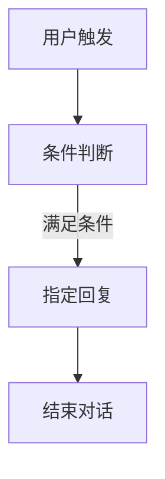
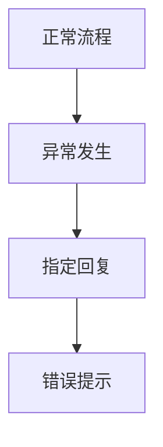
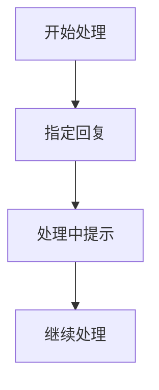
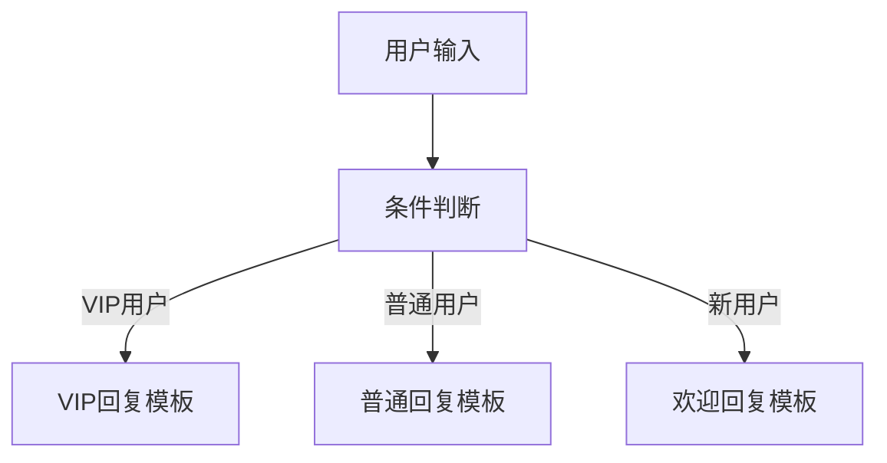
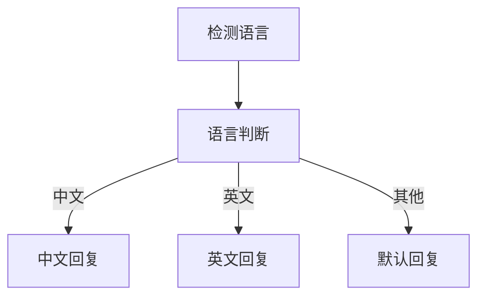

# 指定回复

## 特点

- 可重复添加（防止复杂编排时线太乱，重复添加可以更美观）
- 可手动输入
- 可外部输入
- 会输出结果给客户端

指定回复模块通常用于特殊状态回复，回复内容有两种：

1. 一种是手动输入固定内容
2. 一种是通过变量引用

<!-- 指定回复示例图 -->

## 使用场景

### 固定回复

当需要给用户固定的回复内容时：



### 错误处理

当工作流出现错误时的兜底回复：



### 状态通知

向用户通知当前处理状态：



## 配置说明

### 固定内容回复

直接在回复内容框中输入固定的文本：

```
感谢您的咨询！我们已经收到您的问题，将在24小时内回复您。

如有紧急情况，请拨打客服热线：400-123-4567
```

### 变量引用回复

通过变量引用动态生成回复内容：

```
{{用户名}}，您好！

您咨询的{{问题类型}}问题我们已经收到：
{{问题内容}}

我们将安排专业人员为您处理，预计处理时间：{{处理时间}}

感谢您的耐心等待！
```

## 使用示例

### 业务场景回复

**场景：用户查询订单状态**

```
您的订单{{订单号}}当前状态：{{订单状态}}

订单详情：
- 商品：{{商品名称}}
- 数量：{{商品数量}}
- 金额：¥{{订单金额}}
- 下单时间：{{下单时间}}

如需帮助，请联系在线客服。
```

### 错误提示回复

**场景：系统维护期间**

```
系统正在维护中，暂时无法处理您的请求。

维护时间：{{维护开始时间}} - {{维护结束时间}}
预计恢复：{{预计恢复时间}}

给您带来的不便，我们深表歉意。
请稍后再试，谢谢理解！
```

### 流程引导回复

**场景：引导用户完成操作**

```
为了更好地为您服务，请提供以下信息：

1. 您的姓名
2. 联系电话
3. 具体需求描述

您可以直接回复，我们将尽快为您处理。
```

## 高级用法

### 条件回复

结合条件判断节点实现不同情况的回复：



### 多语言回复

根据用户语言设置返回对应语言的回复：



### 富文本回复

支持包含格式的富文本回复：

```markdown
# 欢迎使用FastGPT！

感谢您选择我们的服务，以下是快速入门指南：

## 主要功能
- **AI对话**：智能问答系统
- **工作流**：自定义业务流程
- **知识库**：文档管理和检索

## 联系方式
- 📧 邮箱：support@fastgpt.cn
- 📞 电话：400-123-4567
- 💬 在线客服：点击右下角图标

祝您使用愉快！
```

## 最佳实践

### 内容设计

1. **简洁明了**：回复内容要简洁，突出重点
2. **友好语调**：使用友好、专业的语调
3. **信息完整**：提供用户需要的完整信息
4. **行动指引**：明确告诉用户下一步怎么做

### 变量使用

1. **合理命名**：使用有意义的变量名
2. **默认值处理**：考虑变量为空时的显示
3. **格式统一**：保持变量格式的一致性
4. **安全过滤**：对用户输入的变量进行安全过滤

### 维护管理

1. **模板化管理**：将常用回复制作成模板
2. **版本控制**：记录回复内容的变更历史
3. **效果监控**：监控回复的用户反馈效果
4. **定期更新**：根据业务变化更新回复内容

## 注意事项

- 指定回复会直接输出给用户，请确保内容准确
- 使用变量时要考虑变量可能为空的情况
- 回复内容要符合业务场景和用户期望
- 注意回复的语言风格要与整体服务保持一致
- 对于敏感信息要谨慎处理，避免信息泄露
