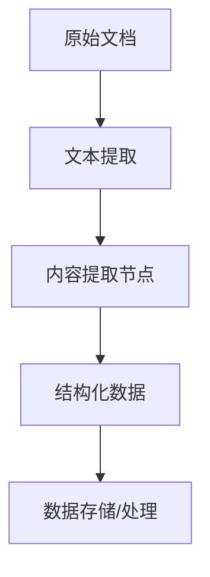
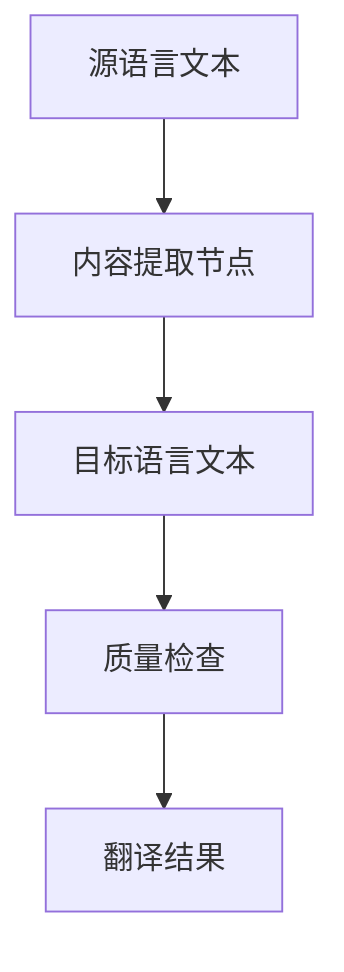
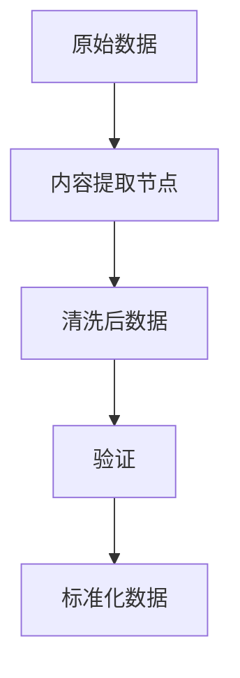

# 文本内容提取

## 特点

- 可重复添加
- 需要手动配置
- 触发执行
- function_call 模块
- 核心模块

<!-- 内容提取模块界面图 -->

## 功能

从文本中提取结构化数据，通常是配合 HTTP 模块实现扩展。也可以做一些直接提取操作，例如：翻译。

## 参数说明

### 提取要求描述

顾名思义，给模型设置一个目标，需要提取哪些内容。

**示例 1 - 信息提取**
```
从以下文本中提取关键信息：
- 人名
- 时间
- 地点
- 事件描述
```

**示例 2 - 数据结构化**
```
将以下非结构化文本转换为JSON格式，包含：
- title: 标题
- content: 主要内容
- tags: 标签列表
- summary: 摘要
```

**示例 3 - 翻译任务**
```
将以下中文翻译成英文，保持原意不变：
```

### 输出配置

你可以配置多个输出字段，每个字段包含：

- **字段名称**：输出字段的标识
- **字段描述**：该字段的详细说明
- **数据类型**：字符串、数字、布尔值、数组等
- **是否必需**：该字段是否为必填项

## 使用场景

### 文档信息提取

从各种文档中提取结构化信息：



### 多语言翻译

实现自动翻译功能：



### 数据清洗

清洗和标准化文本数据：



## 配置示例

### 简历信息提取

**提取要求：**
```
从简历文本中提取以下信息：
1. 基本信息：姓名、电话、邮箱、地址
2. 教育背景：学校、专业、学历、毕业时间
3. 工作经历：公司、职位、工作时间、主要职责
4. 技能特长：技术技能、语言能力、证书资质
```

**输出配置：**
- name (字符串): 姓名
- phone (字符串): 电话号码
- email (字符串): 邮箱地址
- education (数组): 教育经历列表
- experience (数组): 工作经历列表
- skills (数组): 技能列表

### 新闻内容提取

**提取要求：**
```
从新闻文章中提取关键信息：
- 标题
- 摘要
- 主要内容
- 关键词
- 发布时间
- 作者
```

**输出配置：**
- title (字符串): 新闻标题
- summary (字符串): 新闻摘要
- content (字符串): 主要内容
- keywords (数组): 关键词列表
- publish_time (字符串): 发布时间
- author (字符串): 作者姓名

## 最佳实践

1. **明确提取目标**：清晰描述需要提取的信息类型和格式
2. **提供示例**：在提取要求中包含输入输出示例
3. **合理设计输出结构**：根据后续处理需求设计合适的数据结构
4. **错误处理**：考虑提取失败时的备选方案
5. **质量验证**：对提取结果进行验证和检查

## 高级技巧

### 条件提取

```
根据文本类型进行不同的提取：
- 如果是技术文档，提取：概念、方法、示例
- 如果是用户反馈，提取：问题、建议、评分
- 如果是新闻报道，提取：事实、观点、来源
```

### 多级提取

```
分两步提取：
1. 第一步：判断文本类型和主题
2. 第二步：根据类型进行详细信息提取
```

### 质量控制

```
提取时请注意：
1. 确保信息准确性，不要编造内容
2. 保持原文含义不变
3. 如果信息不明确，标记为"未知"
4. 提取的时间格式统一为 YYYY-MM-DD
```
