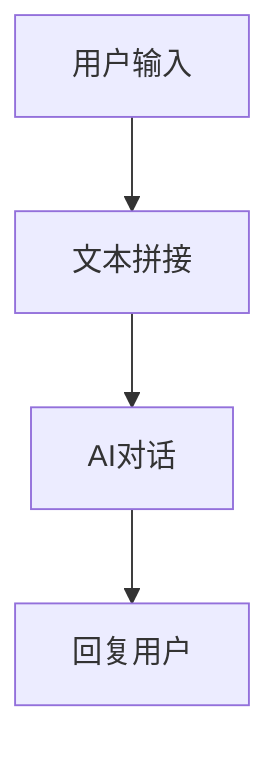
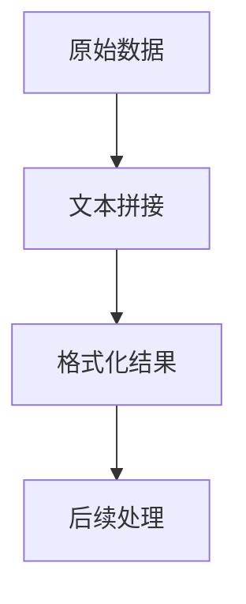
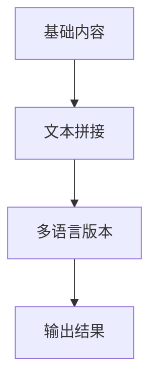
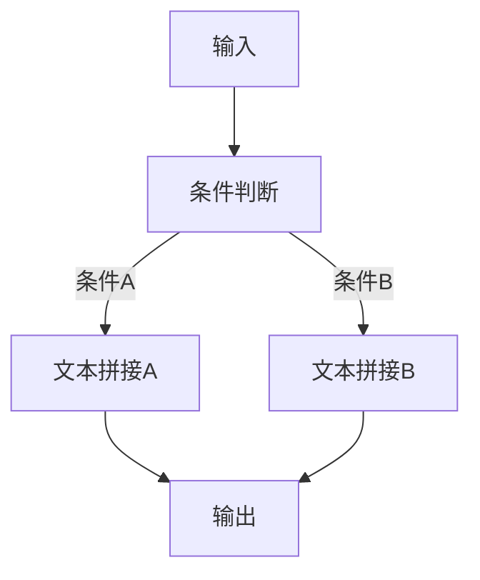
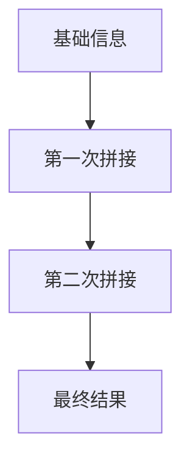

# 文本拼接

## 特点

- 可重复添加
- 有外部输入
- 触发执行
- 手动配置

<!-- 文本拼接模块界面图 -->

## 功能

对输入文本进行固定加工处理，入参仅支持字符串和数字格式，入参以变量形式使用在文本编辑区域。

根据上方示例图的处理方式，对任何输入都会在前面拼接"用户的问题是:"。

## 作用

给任意模块输入自定格式文本，或处理 AI 模块系统提示词。

## 使用场景

### 提示词构造

为AI对话节点构造标准化的提示词：



示例：
- 输入：`用户问题`
- 拼接模板：`作为专业客服，请回答用户问题：{{用户问题}}`
- 输出：`作为专业客服，请回答用户问题：如何重置密码？`

### 数据格式化

将数据格式化为特定格式：



示例：
- 输入：`姓名：张三`，`年龄：25`
- 拼接模板：`用户信息 - 姓名：{{姓名}}，年龄：{{年龄}}岁`
- 输出：`用户信息 - 姓名：张三，年龄：25岁`

### 多语言处理

构造多语言文本：



## 配置说明

### 模板配置

在文本编辑区域中，你可以：

1. **输入固定文本**：直接输入要拼接的固定内容
2. **使用变量**：通过 `{{变量名}}` 的格式引用输入变量
3. **混合使用**：固定文本和变量可以自由组合

### 变量引用

支持的变量类型：
- **字符串变量**：文本内容
- **数字变量**：数值内容
- **全局变量**：工作流中的全局变量
- **节点输出**：前置节点的输出结果

## 使用示例

### 客服回复模板

**输入变量：**
- `用户名`：张先生
- `问题类型`：技术支持
- `问题描述`：软件无法启动

**拼接模板：**
```
尊敬的{{用户名}}，您好！

感谢您联系我们的{{问题类型}}团队。我们已经收到您反馈的问题：{{问题描述}}

我们将在24小时内为您提供解决方案，请耐心等待。

如有紧急情况，请拨打客服热线：400-123-4567

此致
FastGPT客服团队
```

**输出结果：**
```
尊敬的张先生，您好！

感谢您联系我们的技术支持团队。我们已经收到您反馈的问题：软件无法启动

我们将在24小时内为您提供解决方案，请耐心等待。

如有紧急情况，请拨打客服热线：400-123-4567

此致
FastGPT客服团队
```

### JSON格式构造

**输入变量：**
- `订单号`：20240101001
- `商品名称`：智能手机
- `数量`：2
- `金额`：3999.00

**拼接模板：**
```json
{
  "order_id": "{{订单号}}",
  "product_name": "{{商品名称}}",
  "quantity": {{数量}},
  "amount": {{金额}},
  "status": "待支付",
  "create_time": "{{current_time}}"
}
```

### SQL语句构造

**输入变量：**
- `表名`：users
- `用户ID`：12345
- `状态`：active

**拼接模板：**
```sql
SELECT * FROM {{表名}} 
WHERE user_id = {{用户ID}} 
AND status = '{{状态}}' 
ORDER BY create_time DESC 
LIMIT 10;
```

## 高级技巧

### 条件文本

虽然文本拼接节点本身不支持条件逻辑，但可以结合其他节点实现：



### 多级拼接

通过多个文本拼接节点实现复杂的文本构造：



### 模板复用

将常用的文本模板保存为模板，提高工作效率：

1. **邮件模板**：各种场景的邮件格式
2. **通知模板**：系统通知的标准格式
3. **报告模板**：数据报告的格式模板
4. **API调用模板**：标准的API请求格式

## 最佳实践

1. **模板清晰**：使用清晰的模板结构，便于维护
2. **变量命名**：使用有意义的变量名，便于理解
3. **格式规范**：保持一致的格式风格
4. **测试验证**：测试各种输入情况，确保输出正确
5. **性能考虑**：避免过于复杂的模板，影响处理速度

## 注意事项

- 变量名区分大小写
- 未定义的变量会显示为空字符串
- 数字变量无需加引号，字符串变量需要根据上下文决定
- 特殊字符需要进行适当的转义处理
