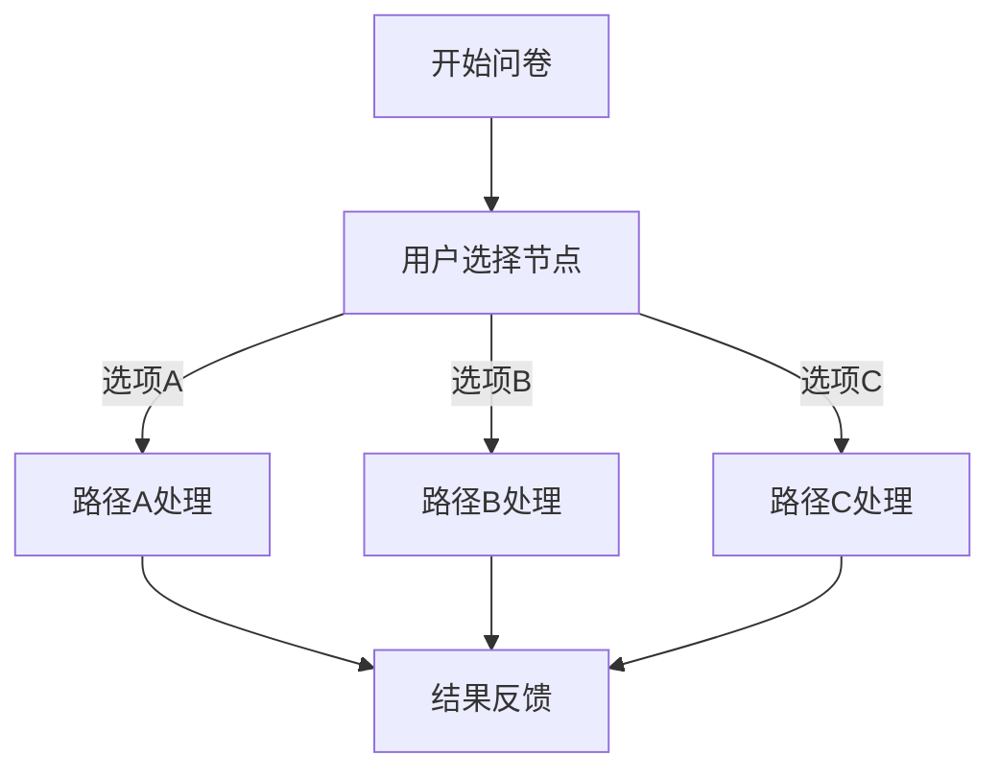
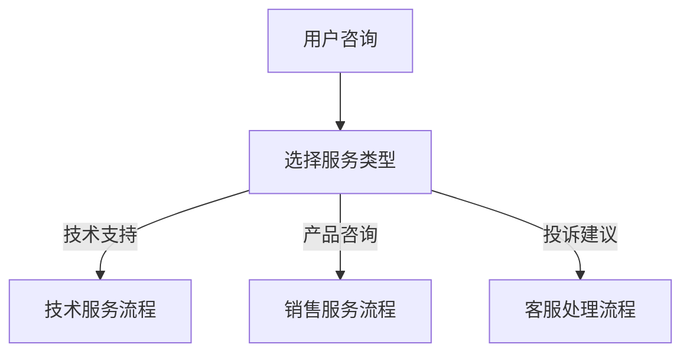

# 用户选择

## 特点 

- 用户交互
- 可重复添加
- 触发执行

<!-- 用户选择模块界面图 -->

## 功能 

「用户选择」节点属于用户交互节点，当触发这个节点时，对话会进入"交互"状态，会记录工作流的状态，等用户完成交互后，继续向下执行工作流。

<!-- 用户选择状态图 -->

当触发用户选择节点时，对话框隐藏，对话进入"交互状态"。

<!-- 用户选择结果图 -->

当用户做出选择时，节点会判断用户的选择，执行"是"的分支。

## 作用

基础的用法为提出需要用户做抉择的问题，然后根据用户的反馈设计不同的工作流流程。

## 使用场景

### 问卷调查

创建交互式问卷，根据用户选择提供个性化服务：

### 服务分流

根据用户需求类型分配不同的服务流程：

## 配置说明

### 选项配置

- **选项文本**：显示给用户的选择内容
- **选项值**：内部识别的选项标识
- **描述信息**：选项的详细说明
- **排序权重**：选项显示的顺序

### 交互设置

- **提示文本**：向用户说明选择目的的文字
- **是否必选**：用户是否必须做出选择
- **超时设置**：等待用户选择的最长时间
- **默认选项**：超时后的默认选择

## 最佳实践

1. **选项清晰明确**：确保每个选项的含义明确，避免歧义
2. **数量适中**：选项数量不宜过多，一般3-5个为宜
3. **逻辑合理**：选项之间要互斥且完整覆盖所有情况
4. **用户友好**：使用用户容易理解的语言表达
5. **设置默认值**：为避免用户无响应，设置合理的默认选项

## 注意事项

- 用户选择节点会暂停工作流执行，等待用户交互
- 需要考虑用户可能不做选择的情况
- 在移动端要确保选项显示和操作的友好性
- 可以结合其他节点实现复杂的交互逻辑
