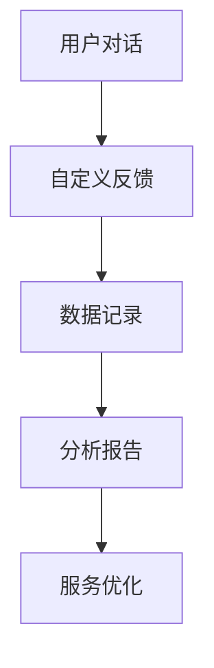
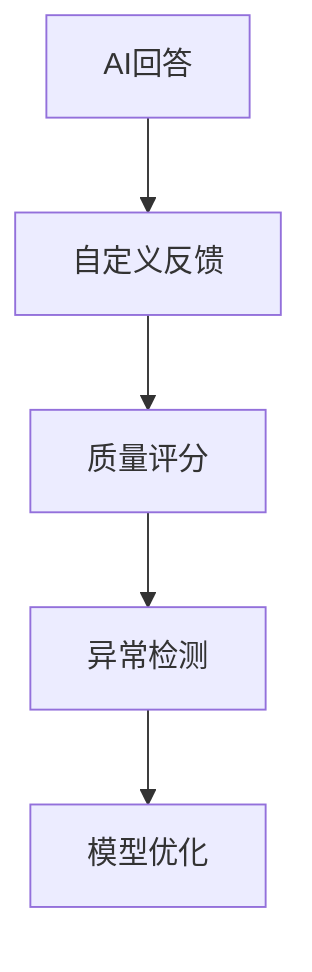
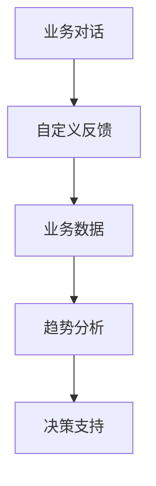

# 自定义反馈

该模块为临时模块，后续会针对该模块进行更全面的设计。

## 特点

- 可重复添加
- 无外部输入
- 自动执行

## 介绍

自定义反馈模块，可以为你的对话增加一个反馈标记，从而方便在后台更好的分析对话的数据。

在调试模式下，不会记录反馈内容，而是直接提示: `自动反馈测试: 反馈内容`。

在对话模式（对话、分享窗口、带 chatId 的 API 调用）时，会将反馈内容记录到对话日志中。（会延迟60s记录）

## 作用

自定义反馈模块的功能类似于程序开发的`埋点`，便于你观测的对话中的数据。

## 使用场景

### 数据分析

收集用户行为和对话质量数据：



### 质量监控

监控AI回答的质量和用户满意度：



### 业务洞察

收集业务相关的用户反馈：



## 配置示例

### 用户满意度反馈

```json
{
  "feedbackType": "satisfaction",
  "score": "{{满意度评分}}",
  "comment": "{{用户评价}}",
  "timestamp": "{{current_time}}",
  "conversationId": "{{conversation_id}}"
}
```

### 功能使用反馈

```json
{
  "feedbackType": "feature_usage",
  "feature": "{{使用的功能}}",
  "success": "{{是否成功}}",
  "errorMessage": "{{错误信息}}",
  "userId": "{{user_id}}"
}
```

### 内容质量反馈

```json
{
  "feedbackType": "content_quality",
  "accuracy": "{{准确性评分}}",
  "relevance": "{{相关性评分}}",
  "completeness": "{{完整性评分}}",
  "source": "{{信息来源}}"
}
```

## 反馈数据结构

### 基础字段

- **反馈类型**：用于分类不同类型的反馈
- **时间戳**：记录反馈产生的时间
- **会话ID**：关联具体的对话会话
- **用户ID**：标识产生反馈的用户

### 自定义字段

- **评分字段**：各种维度的评分
- **文本字段**：用户的文字反馈
- **标签字段**：分类标签和标记
- **元数据**：额外的上下文信息

## 应用示例

### 客服质量监控

```json
{
  "type": "customer_service",
  "agent_performance": {
    "response_time": "{{响应时间}}",
    "solution_accuracy": "{{解决准确性}}",
    "customer_satisfaction": "{{客户满意度}}"
  },
  "issue_type": "{{问题类型}}",
  "resolution_status": "{{解决状态}}"
}
```

### 产品功能使用

```json
{
  "type": "feature_analytics",
  "feature_name": "{{功能名称}}",
  "usage_context": "{{使用场景}}",
  "user_goal": "{{用户目标}}",
  "completion_rate": "{{完成率}}",
  "pain_points": "{{痛点问题}}"
}
```

### 内容推荐效果

```json
{
  "type": "recommendation",
  "recommended_content": "{{推荐内容}}",
  "user_action": "{{用户行为}}",
  "relevance_score": "{{相关性得分}}",
  "click_through": "{{是否点击}}",
  "engagement_time": "{{参与时长}}"
}
```

## 数据分析应用

### 趋势分析

分析用户满意度和使用趋势：

- **时间序列分析**：观察指标随时间的变化
- **用户分群分析**：不同用户群体的行为差异
- **功能使用分析**：各功能的使用频率和效果
- **问题类型分析**：常见问题和解决效率

### 异常检测

识别服务质量异常：

- **满意度下降**：检测满意度突然下降的情况
- **错误率上升**：监控错误率的异常增长
- **响应时间异常**：发现响应时间的异常波动
- **用户流失预警**：识别可能流失的用户

### A/B测试

支持产品功能的A/B测试：

- **版本对比**：对比不同版本的效果
- **功能测试**：测试新功能的用户接受度
- **交互优化**：优化用户交互流程
- **内容效果**：测试不同内容的效果

## 最佳实践

### 反馈设计

1. **目标明确**：明确反馈收集的目标和用途
2. **字段精简**：只收集必要的反馈信息
3. **结构统一**：保持反馈数据结构的一致性
4. **隐私保护**：注意用户隐私和数据安全

### 数据处理

1. **实时处理**：设置合理的数据处理延迟
2. **批量聚合**：对数据进行合理的聚合处理
3. **存储优化**：优化数据存储结构和查询性能
4. **清理策略**：制定数据清理和归档策略

### 分析应用

1. **定期分析**：建立定期的数据分析机制
2. **可视化展示**：使用图表直观展示数据
3. **报告生成**：生成定期的分析报告
4. **行动闭环**：基于分析结果制定改进措施

## 高级功能

### 智能标签

自动为反馈添加智能标签：

```javascript
// 示例：基于内容自动添加标签
function generateTags(feedbackContent) {
  const tags = [];
  
  if (feedbackContent.includes("慢") || feedbackContent.includes("卡")) {
    tags.push("性能问题");
  }
  
  if (feedbackContent.includes("不准确") || feedbackContent.includes("错误")) {
    tags.push("准确性问题");
  }
  
  if (feedbackContent.includes("满意") || feedbackContent.includes("好")) {
    tags.push("正面反馈");
  }
  
  return tags;
}
```

### 情感分析

分析用户反馈的情感倾向：

```json
{
  "sentiment_analysis": {
    "polarity": "positive", // positive, negative, neutral
    "confidence": 0.85,
    "emotions": ["satisfaction", "relief"],
    "keywords": ["很好", "满意", "解决了"]
  }
}
```

### 预警机制

基于反馈数据设置预警：

```javascript
// 示例：满意度预警机制
function checkSatisfactionAlert(recentFeedback) {
  const avgSatisfaction = calculateAverage(recentFeedback, 'satisfaction');
  const threshold = 3.0; // 5分制下的预警阈值
  
  if (avgSatisfaction < threshold) {
    return {
      alert: true,
      level: "warning",
      message: `用户满意度下降至${avgSatisfaction}，需要关注`,
      recommendation: "建议检查最近的服务质量"
    };
  }
  
  return { alert: false };
}
```

## 注意事项

1. **性能影响**：反馈记录可能影响对话性能
2. **数据量控制**：控制反馈数据的数量和频率
3. **隐私合规**：确保符合数据隐私保护要求
4. **存储成本**：考虑长期数据存储的成本
5. **分析能力**：确保有能力分析和利用收集的数据
6. **用户体验**：反馈收集不应影响用户体验
