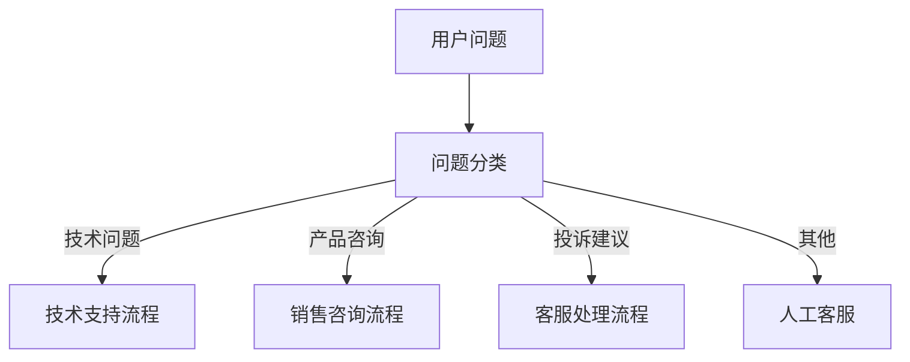
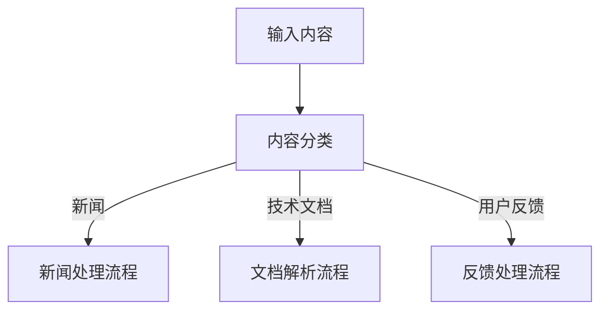

# 问题分类

## 特点

- 可重复添加
- 有外部输入
- 需要手动配置
- 触发执行
- function_call 模块

<!-- 问题分类模块界面图 -->

## 功能

可以将用户的问题进行分类，分类后执行不同操作。在一些较模糊的场景中，分类效果不是很明显。

## 参数说明

### 系统提示词

被放置在对话最前面，可用于补充说明分类内容的定义。例如问题会被分为：

1. 打招呼
2. 技术问题  
3. 产品咨询
4. 投诉建议

你可以在系统提示词中详细说明每个分类的具体含义和判断标准。

### 分类配置

对于每个分类选项，你需要配置：

- **分类名称**：分类的标识名称
- **分类描述**：详细描述该分类的判断标准
- **关键词**：帮助AI判断的关键词列表
- **示例问题**：该分类的典型问题示例

## 使用场景

### 客服场景

根据用户问题类型，路由到不同的处理流程：



### 内容处理

对不同类型的内容采用不同的处理策略：



## 配置示例

### 客服分类示例

**系统提示词：**
```
你是一个专业的客服助手，需要对用户问题进行准确分类。
请根据问题内容判断用户的真实意图，选择最合适的分类。
```

**分类配置：**

1. **技术支持**
   - 描述：产品使用中遇到的技术问题和故障
   - 关键词：Bug、错误、无法使用、崩溃、异常
   - 示例：软件打不开了、出现错误代码

2. **产品咨询**
   - 描述：关于产品功能、价格、购买等咨询
   - 关键词：功能、价格、购买、版本、升级
   - 示例：这个功能怎么用？价格是多少？

3. **投诉建议**
   - 描述：用户对产品或服务的投诉和改进建议
   - 关键词：投诉、建议、不满意、改进
   - 示例：服务态度不好、希望增加某个功能

## 最佳实践

1. **清晰的分类标准**：确保分类之间有明确的界限，避免重叠
2. **充足的训练数据**：提供足够的示例帮助AI理解分类标准
3. **定期优化调整**：根据实际使用效果调整分类配置
4. **设置默认分类**：为无法准确分类的问题设置默认处理流程
5. **分类结果验证**：定期检查分类准确性，优化提示词和配置

## 注意事项

- 分类效果很大程度上依赖于提示词的质量
- 在模糊场景中，建议增加人工审核环节
- 避免分类过于细化，保持合理的分类粒度
- 考虑用户表达的多样性，包含各种可能的说法
