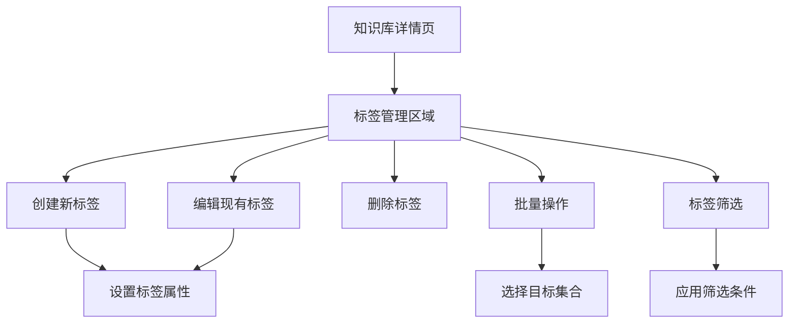

# 知识库集合标签

FastGPT 知识库集合标签功能详解，实现精确的数据分类和搜索。

:::warning 商业版功能
知识库集合标签是 FastGPT 商业版特有功能。
:::

## 功能概述

知识库集合标签允许你对知识库中的数据集合添加标签进行分类，更高效地管理知识库数据。通过标签系统，可以在问答中搜索知识库时添加集合过滤，实现更精确的搜索结果。

## 核心优势

### 🏷️ 灵活分类
- **多维度标签**：支持为数据集合添加多个标签
- **层级管理**：实现知识内容的结构化组织
- **快速筛选**：基于标签快速定位相关内容

### 🎯 精确搜索
- **标签过滤**：在知识库搜索时使用标签条件
- **组合查询**：支持AND/OR逻辑组合
- **时间过滤**：结合创建时间进行筛选

### 📊 高效管理
- **批量操作**：一次为多个集合添加标签
- **统计分析**：查看标签使用情况
- **智能推荐**：基于内容自动推荐标签

## 标签管理操作

### 基础操作

在知识库详情页面，可以对标签进行全面管理：

#### 1. 创建标签
- 点击"新建标签"按钮
- 输入标签名称和描述
- 设置标签颜色（便于视觉区分）
- 保存标签配置

#### 2. 修改标签
- 选择要修改的标签
- 更新标签名称、描述或颜色
- 确认修改操作

#### 3. 删除标签
- 选择要删除的标签
- 确认删除操作
- 系统会自动处理相关联的数据集合

#### 4. 批量标签操作
- **一对多**：将一个标签赋给多个数据集合
- **多对一**：给一个数据集合添加多个标签
- **批量移除**：批量移除特定标签

#### 5. 标签筛选
- 使用标签快速筛选数据集合
- 支持多标签组合筛选
- 实时更新筛选结果

### 标签管理界面



## 知识库搜索 - 集合过滤

### 基本语法

在知识库搜索时，通过填写「集合过滤」实现精确搜索：

```json
{
  "tags": {
    "$and": ["标签1", "标签2"],
    "$or": ["标签3", "标签4"]
  },
  "createTime": {
    "$gte": "2024-01-01 00:00",
    "$lte": "2024-12-31 23:59"
  }
}
```

### 详细语法说明

#### 标签过滤
```json
{
  "tags": {
    "$and": ["技术文档", "API"],
    "$or": ["入门教程", "高级指南"]
  }
}
```

**参数说明：**
- `$and`：AND 逻辑，必须同时包含所有指定标签
- `$or`：OR 逻辑，包含任意一个指定标签即可
- 标签值可以是字符串或 `null`（代表未设置标签的集合）

#### 时间过滤
```json
{
  "createTime": {
    "$gte": "2024-01-01 00:00",
    "$lte": "2024-03-31 23:59"
  }
}
```

**参数说明：**
- `$gte`：大于等于指定时间（Greater Than or Equal）
- `$lte`：小于等于指定时间（Less Than or Equal）
- 时间格式：`YYYY-MM-DD HH:mm`

### 实际应用示例

#### 示例1：查找技术文档
```json
{
  "tags": {
    "$and": ["技术文档", "已审核"]
  }
}
```

#### 示例2：查找最近更新的内容
```json
{
  "tags": {
    "$or": ["新功能", "更新"]
  },
  "createTime": {
    "$gte": "2024-01-01 00:00"
  }
}
```

#### 示例3：查找未分类内容
```json
{
  "tags": {
    "$and": [null]
  }
}
```

#### 示例4：复杂组合查询
```json
{
  "tags": {
    "$and": ["产品文档", "v2.0"],
    "$or": ["API", "SDK"]
  },
  "createTime": {
    "$gte": "2024-01-01 00:00",
    "$lte": "2024-06-30 23:59"
  }
}
```

## 标签策略建议

### 标签命名规范

#### 1. 内容类型标签
- `📚 文档类型`：技术文档、用户手册、API文档
- `🎯 功能模块`：用户管理、订单系统、支付功能
- `📖 难度等级`：入门、进阶、高级、专家

#### 2. 状态标签
- `✅ 审核状态`：已审核、待审核、已发布
- `🔄 更新状态`：最新、过期、需更新
- `🌟 质量等级`：高质量、标准、待优化

#### 3. 业务标签
- `🏢 部门归属`：技术部、产品部、运营部
- `👥 目标用户`：开发者、管理员、普通用户
- `🌍 语言版本`：中文、英文、多语言

### 标签使用最佳实践

#### 1. 层次化组织
```
产品功能/
├── 用户管理/
│   ├── 注册登录
│   ├── 权限控制
│   └── 个人资料
├── 订单系统/
│   ├── 下单流程
│   ├── 支付处理
│   └── 订单查询
└── 数据分析/
    ├── 报表生成
    ├── 统计指标
    └── 可视化图表
```

#### 2. 多维度标签
为同一个数据集合添加多个维度的标签：
- **内容类型**：API文档
- **功能模块**：用户管理
- **难度等级**：进阶
- **更新状态**：最新
- **目标用户**：开发者

#### 3. 定期维护
- **清理无用标签**：删除不再使用的标签
- **合并重复标签**：统一相似含义的标签
- **更新标签描述**：保持标签信息的准确性
- **标签使用统计**：分析标签使用频率

## 高级功能

### 标签自动化

#### 1. 智能标签推荐
- 基于内容自动推荐相关标签
- 机器学习算法分析文本特征
- 提供标签建议列表

#### 2. 批量标签更新
- 基于规则批量添加标签
- 正则表达式匹配内容
- 定时任务自动维护

#### 3. 标签继承
- 子集合继承父集合标签
- 层级结构自动应用标签
- 简化标签管理工作

### 标签分析

#### 1. 使用统计
- 标签使用频率分析
- 热门标签排行
- 标签关联分析

#### 2. 效果评估
- 搜索准确率提升
- 用户查找效率改善
- 内容利用率统计

## 注意事项

### ⚠️ 重要提醒

1. **逻辑优先级**：当同时设置 `$and` 和 `$or` 时，只有 `$and` 会生效
2. **标签值类型**：支持字符串类型的标签名，也支持 `null`（未设置标签）
3. **时间格式**：严格按照 `YYYY-MM-DD HH:mm` 格式填写

### 📋 最佳实践

1. **标签设计**：
   - 使用清晰、描述性的标签名
   - 避免标签名称冲突
   - 建立标签命名规范

2. **查询优化**：
   - 合理使用AND/OR逻辑
   - 结合时间过滤提高精度
   - 避免过于复杂的查询条件

3. **性能考虑**：
   - 避免创建过多细粒度标签
   - 定期清理无用标签
   - 监控查询性能

## 常见问题

### Q: 如何设计有效的标签体系？

**A: 建议遵循以下原则：**
- **MECE原则**：相互独立，完全穷尽
- **层次清晰**：建立明确的标签层级
- **业务导向**：围绕实际业务需求设计
- **易于理解**：使用通俗易懂的标签名

### Q: 标签过多会影响性能吗？

**A: 性能优化建议：**
- 控制标签总数量（建议不超过100个）
- 避免过于细粒度的标签
- 定期清理无用标签
- 使用索引优化查询性能

### Q: 如何处理标签冲突？

**A: 冲突处理方案：**
- 建立标签命名规范
- 定期进行标签去重
- 使用标签合并功能
- 设置标签审核流程

---

*参考来源：[FastGPT 官方文档](https://doc.fastgpt.cn/docs/introduction/guide/knowledge_base/collection_tags)*
