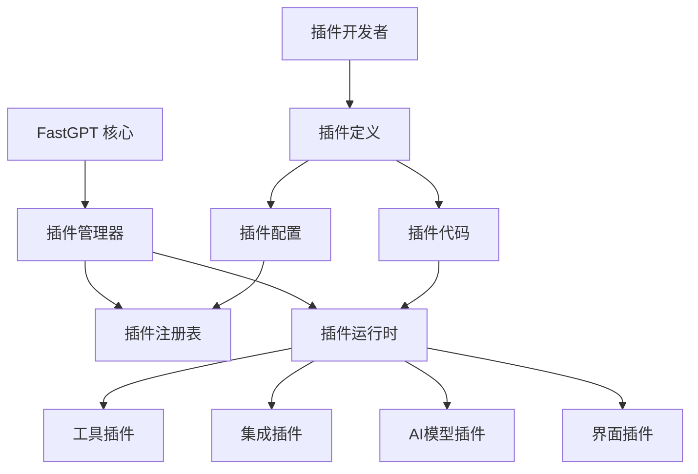

# 系统插件介绍

FastGPT 的系统插件功能让您可以扩展平台的能力，通过自定义插件实现更复杂的业务逻辑和第三方集成。

## 什么是系统插件

系统插件是 FastGPT 的扩展机制，它允许开发者：

- **扩展功能**：添加平台没有的功能模块
- **第三方集成**：连接外部系统和服务
- **自定义逻辑**：实现特定的业务逻辑
- **复用组件**：创建可复用的功能组件

## 插件类型

### 1. 工具插件

用于执行特定任务的工具类插件：

- **数据处理工具**：数据清洗、转换、分析
- **文件处理工具**：文件上传、下载、转换
- **通知工具**：邮件、短信、推送通知
- **计算工具**：数学计算、统计分析

### 2. 集成插件

与第三方服务集成的插件：

- **API 集成**：调用外部 API 服务
- **数据库连接**：连接各种数据库
- **云服务集成**：对接云平台服务
- **企业系统集成**：连接 ERP、CRM 等系统

### 3. AI 模型插件

扩展 AI 能力的插件：

- **自定义模型**：集成私有部署的模型
- **专用模型**：特定领域的专业模型
- **图像处理**：图像识别、生成、编辑
- **语音处理**：语音识别、合成、分析

### 4. 界面插件

扩展用户界面的插件：

- **自定义组件**：特殊的输入输出组件
- **数据可视化**：图表、报表展示
- **交互控件**：按钮、表单、选择器
- **布局组件**：特殊的页面布局

## 插件架构



## 内置插件

FastGPT 提供了一些常用的内置插件：

### 1. HTTP 请求插件

用于调用外部 HTTP API：

**功能特点：**
- 支持 GET/POST/PUT/DELETE 等方法
- 可配置请求头和认证
- 支持响应数据处理
- 提供错误处理机制

**使用场景：**
- 调用第三方 API
- 获取外部数据
- 发送通知消息
- 数据同步操作


### 2. 数据库查询插件

连接和查询数据库：

**功能特点：**
- 支持 MySQL、PostgreSQL、MongoDB
- 可执行 SQL 查询和更新
- 提供连接池管理
- 支持事务处理

**使用场景：**
- 查询业务数据
- 更新数据状态
- 数据统计分析
- 历史记录查询

### 3. 文件处理插件

处理各种文件操作：

**功能特点：**
- 文件上传下载
- 格式转换处理
- 内容解析提取
- 批量文件操作

**使用场景：**
- 文档处理自动化
- 数据导入导出
- 文件格式转换
- 内容分析提取

### 4. 邮件发送插件

发送邮件通知：

**功能特点：**
- 支持 HTML 邮件
- 可添加附件
- 支持邮件模板
- 批量发送功能

**使用场景：**
- 通知发送
- 报告邮件
- 告警通知
- 营销邮件

## 插件开发

### 1. 开发环境准备

开发插件需要准备：

- **开发工具**：支持 JavaScript/TypeScript 的 IDE
- **Node.js 环境**：用于插件开发和测试
- **FastGPT SDK**：插件开发工具包
- **测试环境**：用于插件测试的 FastGPT 实例

### 2. 插件结构

一个标准的插件包含以下文件：

```
my-plugin/
├── package.json          # 插件包信息
├── plugin.json          # 插件配置文件
├── index.js             # 插件入口文件
├── config/              # 配置文件目录
│   └── schema.json      # 配置项定义
├── handlers/            # 处理器目录
│   ├── main.js          # 主处理逻辑
│   └── utils.js         # 工具函数
├── templates/           # 模板目录
│   └── config.html      # 配置界面模板
└── docs/               # 文档目录
    └── README.md       # 插件说明文档
```

### 3. 插件定义

`plugin.json` 文件定义插件的基本信息：

```json
{
  "id": "my-custom-plugin",
  "name": "我的自定义插件",
  "version": "1.0.0",
  "description": "这是一个示例插件",
  "author": "开发者姓名",
  "type": "tool",
  "category": "数据处理",
  "icon": "icon-url",
  "config": {
    "schema": "./config/schema.json",
    "template": "./templates/config.html"
  },
  "handlers": {
    "main": "./handlers/main.js"
  },
  "permissions": [
    "http.request",
    "file.read",
    "file.write"
  ]
}
```

### 4. 插件代码

插件的主要逻辑在处理器文件中实现：

```javascript
// handlers/main.js
const { PluginHandler } = require('@fastgpt/plugin-sdk');

class MyPluginHandler extends PluginHandler {
  constructor(config) {
    super(config);
  }

  async execute(input, context) {
    try {
      // 插件主要逻辑
      const { data, options } = input;
      
      // 处理数据
      const result = await this.processData(data, options);
      
      // 返回结果
      return {
        success: true,
        data: result,
        message: '处理成功'
      };
    } catch (error) {
      return {
        success: false,
        error: error.message,
        message: '处理失败'
      };
    }
  }

  async processData(data, options) {
    // 具体的数据处理逻辑
    return data.map(item => ({
      ...item,
      processed: true,
      timestamp: new Date().toISOString()
    }));
  }
}

module.exports = MyPluginHandler;
```

### 5. 配置界面

插件可以提供自定义的配置界面：

```html
<!-- templates/config.html -->
<div class="plugin-config">
  <div class="form-group">
    <label>API 地址：</label>
    <input type="text" name="apiUrl" placeholder="请输入API地址" />
  </div>
  
  <div class="form-group">
    <label>认证密钥：</label>
    <input type="password" name="apiKey" placeholder="请输入API密钥" />
  </div>
  
  <div class="form-group">
    <label>超时时间（秒）：</label>
    <input type="number" name="timeout" value="30" min="1" max="300" />
  </div>
  
  <div class="form-group">
    <label>启用缓存：</label>
    <input type="checkbox" name="enableCache" checked />
  </div>
</div>
```

## 插件部署

### 1. 本地开发

在本地开发和测试插件：

```bash
# 安装依赖
npm install

# 本地测试
npm test

# 构建插件
npm run build

# 本地调试
npm run dev
```

### 2. 插件注册

将插件注册到 FastGPT：

```javascript
// 注册插件
const plugin = require('./my-plugin');
fastgpt.plugins.register(plugin);

// 或通过配置文件注册
fastgpt.loadPlugin('./plugins/my-plugin');
```

### 3. 插件发布

发布插件到插件市场：

1. **打包插件**：创建插件压缩包
2. **提交审核**：提交到插件市场审核
3. **发布上线**：审核通过后发布
4. **维护更新**：持续维护和更新插件

## 插件管理

### 1. 插件安装

从插件市场安装插件：

- 浏览插件市场
- 搜索需要的插件
- 查看插件详情和评价
- 点击安装插件

### 2. 插件配置

安装后配置插件：

- 打开插件配置页面
- 填写必要的配置信息
- 测试插件连接
- 保存配置

### 3. 插件使用

在工作流中使用插件：

- 在模块库中找到插件
- 拖拽到工作流画布
- 配置插件参数
- 连接其他模块

### 4. 插件更新

保持插件为最新版本：

- 检查插件更新
- 阅读更新说明
- 确认兼容性
- 执行更新操作

## 最佳实践

### 1. 插件设计

设计高质量的插件：

- **单一职责**：每个插件专注一个功能
- **配置灵活**：提供丰富的配置选项
- **错误处理**：完善的错误处理机制
- **性能优化**：优化执行效率

### 2. 安全考虑

确保插件安全：

- **权限控制**：最小权限原则
- **数据验证**：验证输入数据
- **安全通信**：使用 HTTPS 等安全协议
- **敏感信息**：安全存储配置信息

### 3. 文档编写

编写完善的文档：

- **使用说明**：详细的使用指南
- **配置说明**：参数配置说明
- **示例代码**：提供使用示例
- **常见问题**：列出常见问题和解决方案

### 4. 测试验证

充分测试插件：

- **功能测试**：验证功能正确性
- **性能测试**：测试性能表现
- **兼容性测试**：测试平台兼容性
- **安全测试**：验证安全性

## 常见问题

### Q: 如何开发自定义插件？

A: 可以参考以下步骤：
1. 准备开发环境
2. 创建插件项目
3. 编写插件代码
4. 测试插件功能
5. 打包发布插件

### Q: 插件出现错误怎么办？

A: 检查以下几个方面：
- 插件配置是否正确
- 输入数据格式是否匹配
- 网络连接是否正常
- 插件版本是否兼容

### Q: 如何提高插件性能？

A: 可以从以下方面优化：
- 优化算法逻辑
- 减少网络请求
- 使用缓存机制
- 异步处理数据

## 相关文档

- [插件开发指南](./插件开发指南.md)
- [插件 API 参考](./插件API参考.md)
- [插件示例](./插件示例.md)
- [插件市场](./插件市场.md)

