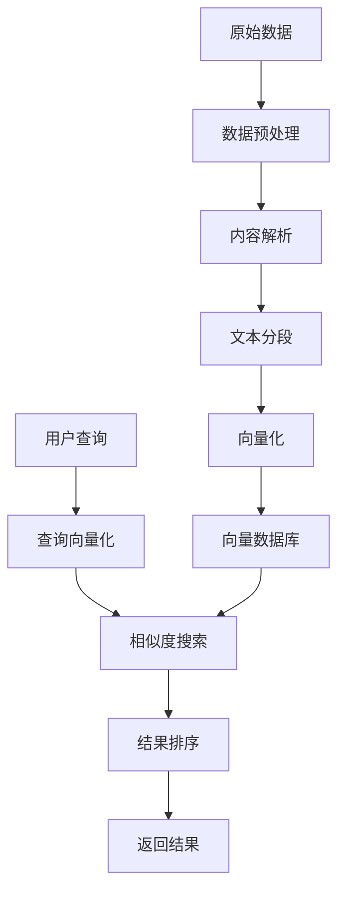
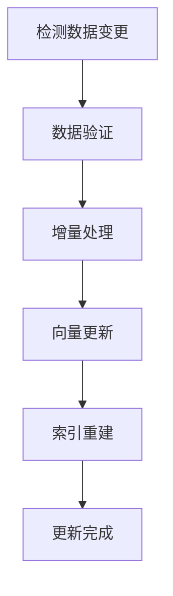

# 知识库管理

FastGPT 的知识库是存储和管理知识的核心系统，支持多种数据格式的导入、智能处理和语义检索。

## 什么是知识库

知识库是 FastGPT 的数据存储中心，它具有以下特点：

- **多格式支持**：支持文档、图片、音频等多种格式
- **智能处理**：自动解析和结构化数据
- **语义检索**：基于向量的语义搜索
- **版本管理**：支持数据的版本控制和更新

## 知识库架构



## 创建知识库

### 1. 新建知识库

在知识库管理页面点击"新建知识库"：


**配置参数：**
- **知识库名称**：给知识库起一个描述性的名称
- **知识库描述**：详细描述知识库的用途和内容
- **向量模型**：选择合适的向量化模型
- **访问权限**：设置知识库的访问权限

### 2. 知识库设置

创建后可以进一步配置：

- **搜索设置**：配置搜索相关参数
- **数据处理**：设置数据处理规则
- **权限管理**：管理访问权限
- **API 配置**：配置 API 访问

## 数据导入

### 1. 支持的数据格式

FastGPT 支持多种数据格式：

**文档类型：**
- Word 文档（.doc, .docx）
- PDF 文件（包括扫描件）
- Excel 表格（.xlsx, .xls）
- PowerPoint 演示文稿（.ppt, .pptx）
- 纯文本文件（.txt, .md）
- CSV 数据文件
- HTML 网页文件

**多媒体类型：**
- 图片文件（.jpg, .png, .gif）
- 音频文件（.mp3, .wav）
- 视频文件（.mp4, .avi）

**其他格式：**
- 压缩包（.zip, .rar）
- 代码文件（各种编程语言）
- JSON/XML 数据文件

### 2. 数据导入方式

#### 2.1 文件上传

最常用的导入方式：


**上传步骤：**
1. 点击"上传文件"按钮
2. 选择要导入的文件
3. 选择数据处理模式
4. 设置处理参数
5. 开始导入处理

**处理模式：**
- **手动输入**：手动编辑问答对
- **QA 拆分**：AI 自动生成问答对
- **直接分段**：按段落直接分割
- **CSV 导入**：批量导入结构化数据

#### 2.2 API 导入

通过 API 批量导入数据：

```bash
# 导入文本数据
curl -X POST "https://api.fastgpt.cn/api/kb/data/pushData" \
  -H "Authorization: Bearer YOUR_API_KEY" \
  -H "Content-Type: application/json" \
  -d '{
    "kbId": "知识库ID",
    "data": [
      {
        "q": "问题内容",
        "a": "答案内容",
        "source": "数据来源"
      }
    ]
  }'
```

#### 2.3 网络爬取

爬取网站内容导入：

**支持的网站类型：**
- 企业官网
- 文档站点
- 博客文章
- 新闻网站

**爬取配置：**
- URL 列表
- 爬取深度
- 内容过滤规则
- 更新频率

#### 2.4 数据库同步

从数据库同步数据：

**支持的数据库：**
- MySQL
- PostgreSQL
- MongoDB
- SQL Server

**同步配置：**
```json
{
  "dbType": "mysql",
  "connection": {
    "host": "localhost",
    "port": 3306,
    "database": "knowledge_db",
    "username": "user",
    "password": "password"
  },
  "query": "SELECT question, answer, category FROM qa_table",
  "mapping": {
    "q": "question",
    "a": "answer",
    "source": "category"
  },
  "schedule": "0 0 * * *"
}
```

## 数据处理

### 1. 文本预处理

数据导入后会进行预处理：

**预处理步骤：**
1. **编码检测**：自动检测文件编码
2. **格式转换**：转换为统一的文本格式
3. **内容清洗**：去除无用的格式信息
4. **结构识别**：识别标题、段落、表格等结构

**处理规则配置：**
```json
{
  "removeHtml": true,
  "removeEmptyLines": true,
  "normalizeWhitespace": true,
  "extractTables": true,
  "extractImages": true,
  "ocrEnabled": true
}
```

### 2. 内容分段

将长文档分割为适合检索的片段：

**分段策略：**
- **按段落分段**：以段落为单位分割
- **按句子分段**：以句子为单位分割
- **按字符分段**：固定字符长度分割
- **语义分段**：基于语义相似度分割

**分段参数：**
- **最大长度**：每个片段的最大字符数
- **重叠长度**：相邻片段的重叠字符数
- **最小长度**：片段的最小字符数
- **分隔符**：用于分割的字符


### 3. 向量化处理

将文本转换为向量表示：

**向量模型选择：**
- **text-embedding-ada-002**：OpenAI 的通用向量模型
- **m3e-base**：中文优化的向量模型
- **bge-large-zh**：中文大规模向量模型
- **自定义模型**：私有部署的向量模型

**向量化配置：**
```json
{
  "model": "text-embedding-ada-002",
  "dimensions": 1536,
  "batchSize": 100,
  "normalizeVector": true,
  "enableCache": true
}
```

### 4. 质量评估

自动评估数据质量：

**评估指标：**
- **内容完整性**：检查内容是否完整
- **格式正确性**：验证数据格式
- **重复检测**：识别重复内容
- **相关性评分**：评估内容相关性

**质量报告：**
```json
{
  "totalChunks": 1000,
  "validChunks": 950,
  "duplicateChunks": 30,
  "lowQualityChunks": 20,
  "averageLength": 150,
  "qualityScore": 0.95
}
```

## 数据管理

### 1. 数据浏览

在知识库管理界面可以：

- **查看数据列表**：浏览所有导入的数据
- **搜索数据**：根据关键词搜索
- **筛选数据**：按来源、时间等筛选
- **预览内容**：查看数据的详细内容


### 2. 数据编辑

支持在线编辑数据：

**编辑功能：**
- **修改内容**：直接编辑问答内容
- **添加标签**：为数据添加分类标签
- **设置权重**：调整数据的检索权重
- **关联数据**：建立数据间的关联关系

### 3. 数据删除

可以删除不需要的数据：

**删除方式：**
- **单条删除**：删除特定的数据条目
- **批量删除**：批量删除多条数据
- **条件删除**：根据条件批量删除
- **清空知识库**：删除所有数据

### 4. 数据备份

定期备份知识库数据：

**备份类型：**
- **完整备份**：备份所有数据和配置
- **增量备份**：只备份变更的数据
- **结构备份**：只备份数据结构
- **云端备份**：备份到云存储

**备份配置：**
```json
{
  "schedule": "0 2 * * *",
  "type": "incremental",
  "retention": 30,
  "compression": true,
  "encryption": true,
  "destination": "s3://backup-bucket/kb-backups/"
}
```

## 搜索与检索

### 1. 搜索算法

FastGPT 使用多种搜索算法：

**向量搜索：**
- 基于语义相似度的搜索
- 支持跨语言检索
- 模糊匹配能力强

**关键词搜索：**
- 基于 BM25 算法
- 支持布尔查询
- 精确匹配能力强

**混合搜索：**
- 结合向量搜索和关键词搜索
- 平衡语义理解和精确匹配
- 提供最佳搜索效果

### 2. 搜索配置

可以配置搜索参数：

**搜索参数：**
- **相似度阈值**：最低相似度要求
- **返回数量**：最多返回的结果数
- **搜索模式**：向量/关键词/混合搜索
- **权重配置**：不同算法的权重分配

```json
{
  "similarity": 0.7,
  "limit": 10,
  "mode": "hybrid",
  "weights": {
    "vector": 0.7,
    "keyword": 0.3
  },
  "rerank": true
}
```

### 3. 结果优化

优化搜索结果质量：

**重排序算法：**
- 基于用户反馈的重排序
- 考虑数据新鲜度
- 结合用户历史偏好

**结果去重：**
- 内容相似度去重
- 来源去重
- 时间窗口去重

**个性化推荐：**
- 基于用户画像
- 历史行为分析
- 协同过滤推荐

## 知识库维护

### 1. 性能监控

监控知识库性能：

**监控指标：**
- **搜索响应时间**：平均搜索耗时
- **索引大小**：向量索引的大小
- **内存使用量**：系统内存占用
- **并发查询数**：同时处理的查询数

**性能优化：**
- 索引优化
- 缓存策略
- 负载均衡
- 资源扩容

### 2. 数据更新

保持数据的及时性：

**更新策略：**
- **实时更新**：数据变更后立即更新
- **批量更新**：定期批量更新数据
- **增量更新**：只更新变更的部分
- **全量重建**：完全重建知识库

**更新流程：**


### 3. 版本管理

管理知识库的版本：

**版本控制：**
- **版本标记**：为每个版本添加标记
- **变更记录**：记录每次变更的详情
- **回滚功能**：支持回滚到历史版本
- **分支管理**：支持多分支开发

**版本信息：**
```json
{
  "version": "1.2.0",
  "createTime": "2024-01-15T10:00:00Z",
  "author": "admin",
  "description": "添加新产品知识库数据",
  "changes": {
    "added": 150,
    "modified": 20,
    "deleted": 5
  }
}
```

## API 接口

### 1. 数据操作 API

通过 API 操作知识库数据：

```javascript
// 获取知识库列表
GET /api/kb/list

// 创建知识库
POST /api/kb/create
{
  "name": "产品知识库",
  "description": "产品相关知识",
  "vectorModel": "text-embedding-ada-002"
}

// 添加数据
POST /api/kb/data/add
{
  "kbId": "kb_123",
  "data": [
    {
      "q": "什么是FastGPT？",
      "a": "FastGPT是一个基于LLM的知识库问答系统",
      "source": "官方文档"
    }
  ]
}

// 搜索数据
POST /api/kb/search
{
  "kbId": "kb_123",
  "query": "FastGPT功能",
  "limit": 10,
  "similarity": 0.7
}
```

### 2. 管理 API

管理知识库的配置和状态：

```javascript
// 获取知识库信息
GET /api/kb/{kbId}/info

// 更新知识库配置
PUT /api/kb/{kbId}/config
{
  "searchConfig": {
    "similarity": 0.8,
    "limit": 15
  }
}

// 获取统计信息
GET /api/kb/{kbId}/stats

// 导出数据
POST /api/kb/{kbId}/export
{
  "format": "json",
  "includeVectors": false
}
```

## 最佳实践

### 1. 数据准备

高质量的数据是成功的关键：

- **数据清洗**：清理无关和错误的数据
- **格式统一**：保持数据格式的一致性
- **内容丰富**：确保内容详细完整
- **结构清晰**：合理组织数据结构

### 2. 分段策略

合理的分段提高检索效果：

- **长度适中**：避免过长或过短的片段
- **语义完整**：保持语义的完整性
- **重叠设计**：适当的重叠避免信息丢失
- **层次结构**：保持文档的层次结构

### 3. 向量模型选择

根据场景选择合适的模型：

- **通用场景**：使用 OpenAI 的通用模型
- **中文场景**：选择中文优化的模型
- **专业领域**：使用领域特定的模型
- **私有部署**：考虑自部署的模型

### 4. 搜索优化

优化搜索配置和策略：

- **阈值调整**：根据实际效果调整相似度阈值
- **算法组合**：合理组合多种搜索算法
- **结果过滤**：过滤低质量的搜索结果
- **用户反馈**：收集用户反馈持续优化

## 常见问题

### Q: 如何提高搜索准确性？

A: 可以从以下几个方面优化：
- 提高数据质量，清理噪声数据
- 优化分段策略，保持语义完整
- 调整相似度阈值
- 使用混合搜索算法
- 收集用户反馈进行优化

### Q: 知识库容量有限制吗？

A: 容量限制取决于您的套餐：
- 免费版：最多 1GB 数据
- 专业版：最多 10GB 数据
- 企业版：无限制

### Q: 支持多语言混合检索吗？

A: 支持，使用多语言向量模型可以实现跨语言检索，但建议按语言分别建立知识库以获得更好的效果。

### Q: 如何备份和恢复知识库？

A: 可以通过以下方式：
- 使用导出功能备份数据
- 定期备份向量索引
- 使用 API 批量导出
- 云端自动备份（企业版）

## 相关文档

- [数据导入详细说明](./数据导入详细说明.md)
- [向量模型配置](./向量模型配置.md)
- [搜索优化指南](./搜索优化指南.md)
- [API 接口文档](../API接口文档.md)

